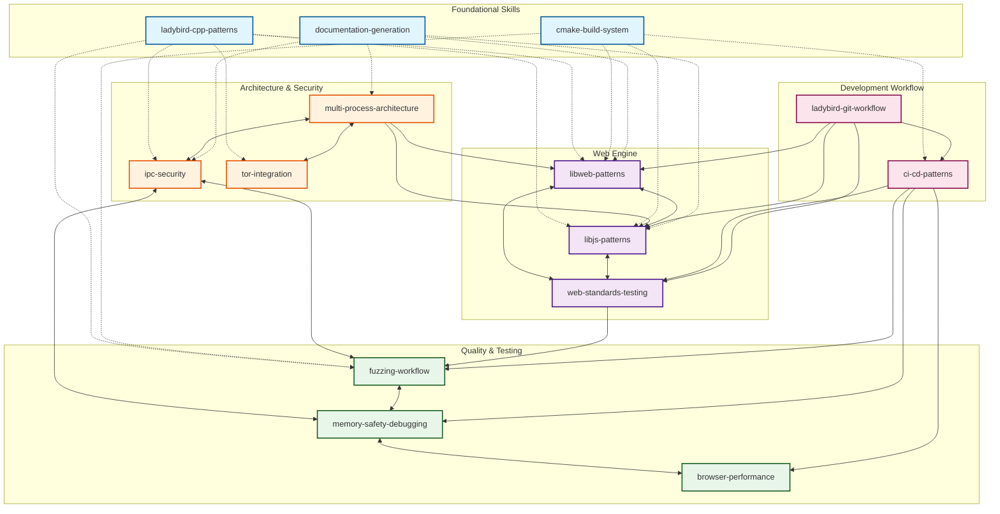

# Ladybird Skills Relationship Map

This document provides a visual overview of how all 14 skills in `.claude/skills/` relate to each other.

## Skill Network Diagram



**Legend**:
- Solid arrows (`→`): Direct dependency or strong relationship
- Dashed arrows (`-.→`): Foundational/support relationship
- Bidirectional arrows (`↔`): Complementary/closely integrated

## Relationship Strength by Connections

### Highly Connected (10+ references)
1. **browser-performance** (11 connections)
2. **documentation-generation** (13 connections)
3. **cmake-build-system** (11 connections - foundational)
4. **ladybird-cpp-patterns** (11 connections - foundational)

### Well Connected (8-10 references)
5. **memory-safety-debugging** (10 connections)
6. **web-standards-testing** (10 connections)
7. **ci-cd-patterns** (10 connections)
8. **libweb-patterns** (10 connections)
9. **ladybird-git-workflow** (10 connections)
10. **libjs-patterns** (9 connections)

### Moderately Connected (6-7 references)
11. **fuzzing-workflow** (7 connections)
12. **multi-process-architecture** (7 connections)
13. **tor-integration** (7 connections)
14. **ipc-security** (6 connections)

## Common Skill Combinations

### For New Contributors
```
ladybird-cpp-patterns
    ↓
cmake-build-system
    ↓
web-standards-testing
    ↓
ladybird-git-workflow
```

### For Web Standards Implementation
```
web-standards-testing
    ↓
libweb-patterns ←→ libjs-patterns
    ↓
documentation-generation
    ↓
ci-cd-patterns
```

### For Security Feature Development
```
multi-process-architecture
    ↓
ipc-security
    ↓
fuzzing-workflow
    ↓
memory-safety-debugging
    ↓
ci-cd-patterns
```

### For Performance Optimization
```
browser-performance
    ↓
memory-safety-debugging
    ↓
(libweb-patterns OR libjs-patterns)
    ↓
web-standards-testing
    ↓
ci-cd-patterns
```

### For Privacy Features
```
tor-integration
    ↓
multi-process-architecture
    ↓
ipc-security
    ↓
documentation-generation
```

## Skill Categories

### Foundation Layer
These skills are prerequisites for most other skills:
- **ladybird-cpp-patterns**: C++ coding patterns (TRY, ErrorOr, smart pointers)
- **cmake-build-system**: Build configuration and compilation
- **documentation-generation**: API and architecture documentation

### Architecture Layer
Understanding Ladybird's structure:
- **multi-process-architecture**: Process isolation and IPC
- **ipc-security**: Secure inter-process communication
- **tor-integration**: Per-tab privacy features

### Implementation Layer
Building features:
- **libweb-patterns**: HTML/CSS/DOM implementation
- **libjs-patterns**: JavaScript engine implementation
- **web-standards-testing**: Testing spec compliance

### Quality Assurance Layer
Ensuring correctness and performance:
- **fuzzing-workflow**: Automated bug discovery
- **memory-safety-debugging**: ASAN/UBSAN debugging
- **browser-performance**: Profiling and optimization

### Workflow Layer
Development processes:
- **ci-cd-patterns**: Continuous integration and deployment
- **ladybird-git-workflow**: Git conventions and PR process

## Usage Patterns

### Pattern 1: Bottom-Up Learning
1. Start with **ladybird-cpp-patterns**
2. Learn **cmake-build-system**
3. Study **multi-process-architecture**
4. Dive into specific component (**libweb-patterns** or **libjs-patterns**)
5. Add **web-standards-testing**
6. Follow **ladybird-git-workflow** for contributions

### Pattern 2: Feature-First Learning
1. Start with feature goal (e.g., implement CSS Grid)
2. Read **web-standards-testing** for test patterns
3. Study **libweb-patterns** for implementation
4. Reference **ladybird-cpp-patterns** as needed
5. Use **cmake-build-system** to build
6. Debug with **memory-safety-debugging**
7. Commit with **ladybird-git-workflow**

### Pattern 3: Security-First Learning
1. Understand **multi-process-architecture**
2. Study **ipc-security** patterns
3. Learn **fuzzing-workflow** for testing
4. Use **memory-safety-debugging** for triage
5. Apply to specific features (**tor-integration**)
6. Integrate with **ci-cd-patterns**

## Cross-Skill Scenarios

### Scenario: Adding New Web API
**Skills needed**: libweb-patterns → web-standards-testing → documentation-generation → ladybird-git-workflow

**Steps**:
1. Read spec (web-standards-testing)
2. Implement in LibWeb (libweb-patterns)
3. Write tests (web-standards-testing)
4. Document API (documentation-generation)
5. Commit changes (ladybird-git-workflow)

### Scenario: Fixing Security Vulnerability
**Skills needed**: fuzzing-workflow → memory-safety-debugging → ipc-security → ci-cd-patterns

**Steps**:
1. Fuzzer finds crash (fuzzing-workflow)
2. Debug with ASAN (memory-safety-debugging)
3. Fix with proper validation (ipc-security)
4. Add regression test (fuzzing-workflow)
5. Verify in CI (ci-cd-patterns)

### Scenario: Optimizing Page Load Time
**Skills needed**: browser-performance → libweb-patterns → memory-safety-debugging → web-standards-testing

**Steps**:
1. Profile page load (browser-performance)
2. Identify hotspot in rendering (browser-performance)
3. Optimize LibWeb code (libweb-patterns)
4. Verify no memory issues (memory-safety-debugging)
5. Ensure tests still pass (web-standards-testing)

## Maintenance

When adding new skills:
1. Add to appropriate category in this diagram
2. Identify foundational dependencies
3. Create bidirectional references to related skills
4. Update skill relationship counts
5. Add to relevant usage patterns

## Quick Reference

**Start here for**:
- General development: **ladybird-cpp-patterns**
- Web features: **libweb-patterns**
- JavaScript features: **libjs-patterns**
- Security work: **ipc-security**
- Performance work: **browser-performance**
- Testing: **web-standards-testing**
- Debugging: **memory-safety-debugging**
- Build issues: **cmake-build-system**
