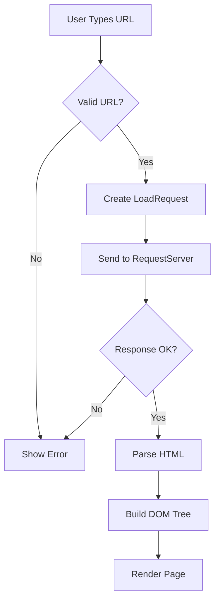
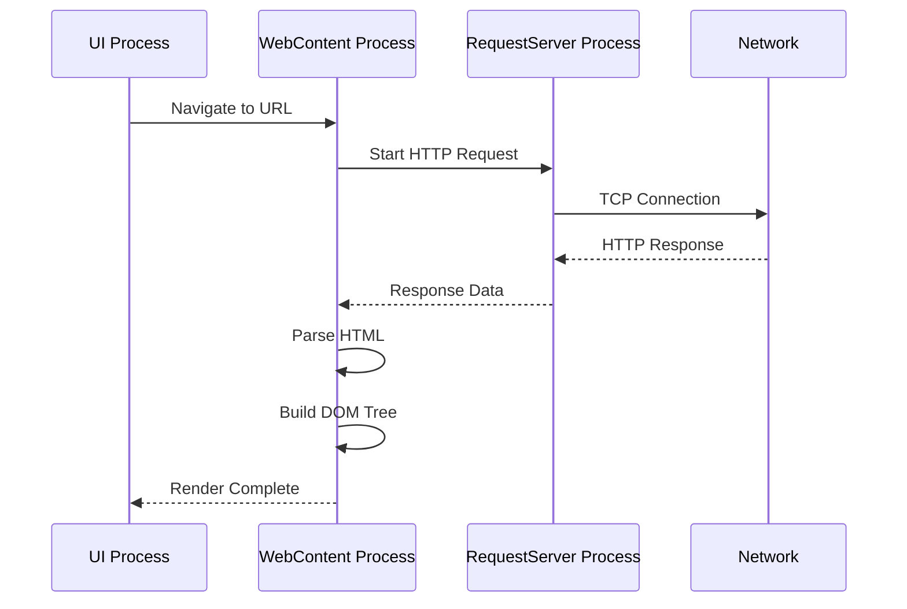
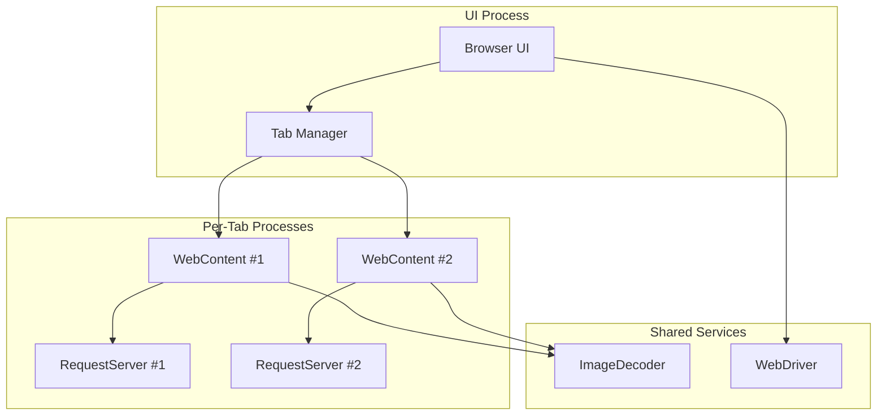
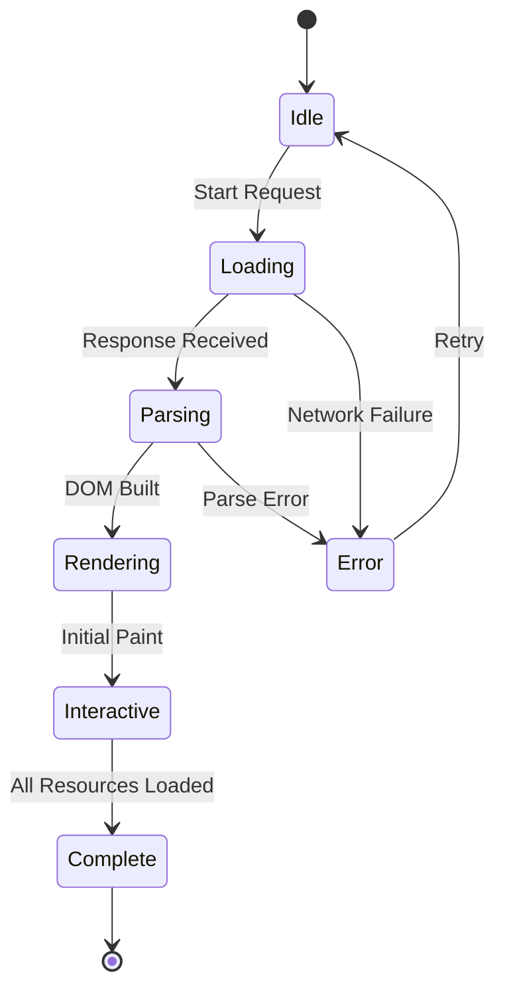
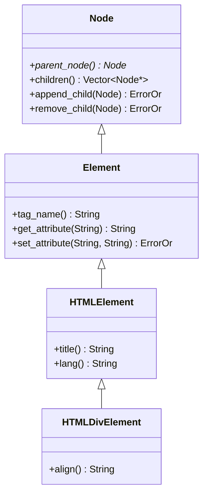

# Documentation Generation and Maintenance

## Overview

High-quality documentation is essential for Ladybird's maintainability and contributor onboarding. This skill covers patterns for generating API documentation, architecture diagrams, and keeping documentation synchronized with code.

### Documentation Philosophy

1. **Code as Primary Documentation**: Well-named classes, functions, and variables are the first layer of documentation
2. **Comments Explain Why**: Code shows what; comments explain why (see `Documentation/CodingStyle.md`)
3. **Spec Compliance**: Link to spec sections for web standards implementation
4. **Living Documentation**: Keep docs in sync with code through automation and reviews
5. **Multiple Audiences**: Serve both contributors (architecture, patterns) and users (guides, APIs)

### Documentation Types

```
Documentation/               # Contributor-focused technical docs
├── CodingStyle.md          # Code style guide
├── ProcessArchitecture.md  # Multi-process architecture
├── LibWebPatterns.md       # LibWeb implementation patterns
├── Testing.md              # Testing guide
└── [...]

docs/                       # Fork-specific user and feature docs
├── SENTINEL_USER_GUIDE.md  # End-user documentation
├── SENTINEL_ARCHITECTURE.md # Technical architecture
├── FEATURES.md             # Feature descriptions
└── [...]

README.md                   # Project overview and quick start
CONTRIBUTING.md             # How to contribute
CHANGELOG.md                # Version history (if maintained)
```

## Pattern 1: Doxygen-Style Code Comments

### When to Use Doxygen Comments

Ladybird generally prefers **self-documenting code** over extensive comments. Use Doxygen-style documentation for:

1. **Public APIs**: Library interfaces exposed to other components
2. **Complex Algorithms**: Non-obvious implementations requiring explanation
3. **Spec Implementations**: Link to spec sections
4. **Tricky Code**: Anything that made you pause while writing it

### Doxygen Comment Format

```cpp
/**
 * @brief Brief one-line description (imperative mood)
 *
 * Detailed description of the function's purpose, behavior, and constraints.
 * Multiple paragraphs are allowed.
 *
 * Link to spec if implementing web standards:
 * https://html.spec.whatwg.org/#dom-document-title
 *
 * @param name Description of parameter (type inferred from signature)
 * @param count Number of items to process (be specific)
 * @return Description of return value and possible error conditions
 * @throws ExceptionType When this exception is thrown
 *
 * @note Additional notes or warnings
 * @warning Important warnings about usage
 * @see RelatedClass Related classes or functions
 *
 * Example usage (if helpful):
 * @code
 * auto result = do_something("test", 42);
 * if (result.is_error())
 *     handle_error(result.error());
 * @endcode
 */
ErrorOr<String> do_something(StringView name, size_t count);
```

### Common Doxygen Tags

- `@brief` - One-line summary (shown in lists)
- `@param` - Parameter description (format: `@param name description`)
- `@return` - Return value description
- `@throws` / `@exception` - Exception documentation
- `@note` - Supplementary notes
- `@warning` - Important warnings
- `@deprecated` - Mark deprecated APIs
- `@see` - Cross-references
- `@code` / `@endcode` - Code examples
- `@todo` - TODOs (better: use `FIXME:` in inline comments)

### Doxygen for Classes

```cpp
/**
 * @class HTTPRequest
 * @brief Represents an HTTP request with headers and body
 *
 * Detailed description of the class's purpose and responsibilities.
 * Explain ownership semantics, threading constraints, etc.
 *
 * @see HTTPResponse
 * @see ConnectionFromClient
 */
class HTTPRequest {
public:
    /**
     * @brief Create an HTTP request
     * @param method HTTP method (GET, POST, etc.)
     * @param url Target URL
     * @return HTTPRequest instance or error
     */
    static ErrorOr<NonnullOwnPtr<HTTPRequest>> create(StringView method, URL::URL url);

private:
    HTTPRequest() = default;
    String m_method;
    URL::URL m_url;
};
```

### Avoid Over-Documentation

```cpp
// Wrong: Obvious documentation adds noise
/**
 * @brief Get the count
 * @return The count
 */
int count() const { return m_count; }

// Right: Self-documenting code
int count() const { return m_count; }

// Wrong: Parroting the code
/**
 * @brief Set the visible flag to true
 */
void set_visible() { m_visible = true; }

// Right: Explain why if non-obvious
// Visibility changes trigger a relayout of the entire page.
void set_visible() { m_visible = true; }
```

## Pattern 2: Architecture Diagrams with Mermaid

### Mermaid Overview

Mermaid is a text-based diagramming tool that renders diagrams from markdown-like syntax. It's ideal for:
- Architecture diagrams
- Sequence diagrams
- State machines
- Flowcharts

Advantages:
- Version controllable (text-based)
- Easy to update (no binary image files)
- Renders in GitHub, GitLab, many markdown viewers
- Can generate PNG/SVG for offline docs

### Flowchart Example



### Sequence Diagram Example



### Architecture Diagram Example



### State Machine Example



### Class Diagram Example



### Mermaid Best Practices

1. **Keep it Simple**: Don't try to show everything in one diagram
2. **Use Subgraphs**: Group related components
3. **Label Relationships**: Make arrows meaningful
4. **Version Control**: Commit `.mmd` source files, generate images in CI
5. **Embed in Markdown**: Reference with relative paths

Example markdown:
```markdown
## Process Architecture

The following diagram shows Ladybird's multi-process architecture:


See [ProcessArchitecture.md](ProcessArchitecture.md) for details.
```

## Pattern 3: API Documentation

### API Reference Structure

```markdown
# LibFoo API Reference

## Overview

Brief description of the library's purpose and use cases.

## Core Classes

### FooManager

Main class for managing Foo resources.

**Include**: `<LibFoo/FooManager.h>`

#### Methods

##### `create()`

```cpp
static ErrorOr<NonnullOwnPtr<FooManager>> create();
```

Creates a new FooManager instance.

**Returns**: `ErrorOr<NonnullOwnPtr<FooManager>>` - Manager instance or error

**Errors**:
- `ENOMEM` - Out of memory
- `ENOENT` - Configuration file not found

**Example**:
```cpp
auto manager = TRY(FooManager::create());
manager->start();
```

##### `process_item()`

```cpp
ErrorOr<void> process_item(FooItem const& item);
```

Processes a single item according to configured rules.

**Parameters**:
- `item` - The item to process (must be valid)

**Returns**: `ErrorOr<void>` - Success or error

**Thread Safety**: This method is not thread-safe. Call from main thread only.

**Example**:
```cpp
FooItem item = create_item();
TRY(manager->process_item(item));
```

## Error Handling

All methods return `ErrorOr<T>` for fallible operations. Use `TRY()` macro:

```cpp
auto result = TRY(operation_that_might_fail());
```

See [Documentation/Patterns.md](../Documentation/Patterns.md) for error handling patterns.

## See Also

- [LibBar API Reference](LibBar.md) - Related library
- [Foo Tutorial](tutorials/foo-tutorial.md) - Step-by-step guide
```

## Pattern 4: Markdown Best Practices

### Structure and Organization

```markdown
# Document Title (H1 - only one per document)

Brief introduction paragraph.

## Section (H2)

Content for the section.

### Subsection (H3)

Subsection content.

#### Sub-subsection (H4)

Rarely needed - consider restructuring if you need H5 or H6.
```

### Linking

```markdown
# Absolute Links (for external resources)
[Ladybird Project](https://ladybird.org)

# Relative Links (for internal docs)
[Coding Style](CodingStyle.md)
[Build Instructions](../README.md#building)

# Link to Heading
[See Testing Section](#testing)

# Link with Anchors
[Architecture Overview](ProcessArchitecture.md#multi-process-design)
```

### Code Blocks

````markdown
# Inline code
Use `ErrorOr<T>` for fallible operations.

# Code blocks with syntax highlighting
```cpp
ErrorOr<void> do_something() {
    auto result = TRY(fallible_operation());
    return {};
}
```

# Shell commands
```bash
cmake --preset Release
cmake --build Build/release
```

# Multi-language examples
```javascript
// JavaScript code
function hello() {
    console.log("Hello");
}
```
````

### Lists

```markdown
# Unordered Lists
- First item
- Second item
  - Nested item (2 spaces indent)
  - Another nested item
- Third item

# Ordered Lists
1. First step
2. Second step
   1. Sub-step (3 spaces indent)
   2. Another sub-step
3. Third step

# Mixed Lists
1. Ordered item
   - Unordered sub-item
   - Another sub-item
2. Second ordered item
```

### Tables

```markdown
| Column 1 | Column 2 | Column 3 |
|----------|----------|----------|
| Value 1  | Value 2  | Value 3  |
| Value 4  | Value 5  | Value 6  |

# Alignment
| Left-aligned | Center-aligned | Right-aligned |
|:-------------|:--------------:|--------------:|
| Left         | Center         | Right         |
```

### Callouts and Admonitions

```markdown
**Note**: Important information that doesn't fit inline.

**Warning**: Critical warnings about potential issues.

**Important**: Emphasize critical points.

**Tip**: Helpful suggestions.

> **Note for Contributors**:
> Multi-line notes can use blockquotes for better readability.
> This makes them stand out from regular text.
```

### Images

```markdown
# Inline images


# Images with titles


# Reference-style images (useful for reuse)
![Process Architecture][arch-diagram]

[arch-diagram]: ./Images/ProcessArchitecture.svg "Multi-Process Architecture"
```

## Pattern 5: README.md Templates

See `templates/readme-template.md` for a comprehensive README structure.

### Essential README Sections

1. **Title and Brief Description**: What is this?
2. **Quick Start**: Get running in 30 seconds
3. **Features**: What does it do?
4. **Installation**: Detailed build instructions
5. **Usage**: How to use it
6. **Documentation**: Links to detailed docs
7. **Contributing**: How to contribute
8. **License**: Legal information

## Pattern 6: CHANGELOG.md Format

### Keep a Changelog Format

Follow [keepachangelog.com](https://keepachangelog.com/) conventions:

```markdown
# Changelog

All notable changes to this project will be documented in this file.

The format is based on [Keep a Changelog](https://keepachangelog.com/en/1.0.0/),
and this project adheres to [Semantic Versioning](https://semver.org/spec/v2.0.0.html).

## [Unreleased]

### Added
- New feature X
- Support for Y

### Changed
- Improved Z performance

### Deprecated
- Old API method (use new_method instead)

### Removed
- Deprecated feature from v1.0

### Fixed
- Bug in edge case handling
- Memory leak in component

### Security
- Fixed CVE-XXXX vulnerability

## [1.2.0] - 2025-11-01

### Added
- Initial implementation of feature A

### Fixed
- Critical bug in feature B

## [1.1.0] - 2025-10-15

...

[Unreleased]: https://github.com/user/repo/compare/v1.2.0...HEAD
[1.2.0]: https://github.com/user/repo/compare/v1.1.0...v1.2.0
[1.1.0]: https://github.com/user/repo/releases/tag/v1.1.0
```

### Changelog Categories

- **Added**: New features
- **Changed**: Changes in existing functionality
- **Deprecated**: Soon-to-be removed features
- **Removed**: Removed features
- **Fixed**: Bug fixes
- **Security**: Security fixes

## Pattern 7: Documentation Automation

### Keeping Docs in Sync

Common documentation drift problems:
1. API signatures change, docs don't update
2. Code examples become outdated
3. Links break when files are renamed
4. Architecture diagrams become stale

### Automation Strategies

#### 1. Pre-commit Hooks

```bash
#!/bin/bash
# .git/hooks/pre-commit

# Check for broken links in documentation
./scripts/check_doc_links.sh || exit 1

# Ensure code examples compile
./scripts/validate_code_examples.sh || exit 1

# Regenerate API docs if needed
./scripts/generate_api_docs.sh --check || exit 1
```

#### 2. CI Documentation Checks

```yaml
# .github/workflows/docs.yml
name: Documentation

on: [push, pull_request]

jobs:
  check-docs:
    runs-on: ubuntu-latest
    steps:
      - uses: actions/checkout@v4
      - name: Check broken links
        run: ./scripts/check_doc_links.sh
      - name: Generate API docs
        run: ./scripts/generate_api_docs.sh
      - name: Render Mermaid diagrams
        run: ./scripts/generate_architecture_diagrams.sh
```

#### 3. Documentation TODOs

Mark outdated documentation explicitly:

```markdown
<!-- TODO(docs): Update this section after IPC refactor (Issue #1234) -->

**Note**: This documentation is for version 1.x. See [Migration Guide](migration.md)
for version 2.x changes.
```

### Documentation Review Checklist

See `references/documentation-checklist.md` for a comprehensive checklist.

**Before submitting PR with code changes**:
- [ ] Updated relevant API documentation
- [ ] Updated code examples if API changed
- [ ] Checked for broken links
- [ ] Updated architecture diagrams if structure changed
- [ ] Added CHANGELOG entry (if maintaining changelog)
- [ ] Verified code examples compile
- [ ] Checked documentation builds without warnings

## Pattern 8: Spec-Driven Documentation

### Linking to Web Standards

For web standards implementation in LibWeb, always link to spec sections:

```cpp
// HTMLInputElement.cpp

// https://html.spec.whatwg.org/#dom-input-value
String HTMLInputElement::value() const
{
    // 1. Let value be the value of this element's value content attribute.
    auto value = get_attribute(HTML::AttributeNames::value);

    // 2. If value is null, return the empty string.
    if (!value.has_value())
        return String {};

    return value.value();
}
```

### Spec Algorithm Comments

Match spec algorithm steps exactly:

```cpp
// https://dom.spec.whatwg.org/#dom-node-appendchild
WebIDL::ExceptionOr<GC::Ref<Node>> Node::append_child(GC::Ref<Node> node)
{
    // 1. Return the result of pre-inserting node into this before null.
    return pre_insert(node, nullptr);
}
```

Benefits:
- Easy to verify correctness against spec
- Helps reviewers understand intent
- Makes spec updates easier to track
- Serves as built-in documentation

## Common Documentation Issues

### Issue 1: Stale Code Examples

**Problem**: Code examples in docs don't compile or use deprecated APIs.

**Solution**:
1. Extract examples to compilable test files
2. Include them in CI builds
3. Use snippet injection from actual code

```cpp
// Example.cpp (compiled in tests)
#include <LibFoo/Foo.h>

void example_usage()
{
    // [example-basic-usage]
    auto manager = MUST(FooManager::create());
    manager->process(item);
    // [example-basic-usage]
}
```

```markdown
# Documentation.md

Basic usage:
```cpp
<!-- #include "Example.cpp" example-basic-usage -->
auto manager = MUST(FooManager::create());
manager->process(item);
```
```

### Issue 2: Broken Links

**Problem**: File renames break documentation links.

**Solution**: Use link checker script (see `scripts/check_doc_links.sh`).

### Issue 3: Outdated Architecture Diagrams

**Problem**: Code changes, diagrams don't update.

**Solution**:
1. Store diagrams as Mermaid `.mmd` text files
2. Generate images in CI
3. Review diagrams during architectural changes

### Issue 4: Missing Documentation for New Features

**Problem**: Features land without documentation.

**Solution**: Make documentation part of "Definition of Done":
- [ ] User-facing: Update user guide
- [ ] API: Update API reference
- [ ] Architecture: Update architecture docs
- [ ] Examples: Add working examples

## Tools and Resources

### Mermaid Tools

- **Mermaid Live Editor**: https://mermaid.live/ (preview diagrams)
- **Mermaid CLI**: `npm install -g @mermaid-js/mermaid-cli` (generate images)
- **VS Code Extension**: "Markdown Preview Mermaid Support"

### Doxygen

- **Doxygen Website**: https://www.doxygen.nl/
- **Download**: https://www.doxygen.nl/download.html
- **Manual**: https://www.doxygen.nl/manual/

### Markdown

- **CommonMark**: https://commonmark.org/ (standard spec)
- **GitHub Flavored Markdown**: https://github.github.com/gfm/
- **Markdownlint**: https://github.com/DavidAnson/markdownlint (linter)

## Examples

See `examples/` directory for:
- `doxygen-comment-example.cpp` - Properly documented C++ code
- `architecture-diagram-example.mmd` - Architecture diagram
- `readme-template.md` - README.md structure
- `api-reference-example.md` - API documentation format
- `changelog-example.md` - CHANGELOG.md format

## Templates

See `templates/` directory for:
- `class-documentation-template.cpp` - Template for documenting classes
- `function-documentation-template.cpp` - Template for functions
- `architecture-doc-template.md` - Architecture documentation
- `feature-doc-template.md` - Feature documentation
- `api-doc-template.md` - API reference documentation

## References

See `references/` directory for:
- `doxygen-reference.md` - Doxygen commands and configuration
- `mermaid-reference.md` - Mermaid diagram types and syntax
- `markdown-style-guide.md` - Ladybird markdown conventions
- `documentation-checklist.md` - Documentation review checklist

## When to Update This Skill

Update this skill when:
- New documentation patterns emerge
- Tooling changes (new Doxygen version, Mermaid features)
- Documentation structure changes
- New automation scripts are added
- Best practices evolve

## Related Skills

- `libweb-patterns` - LibWeb-specific implementation patterns (spec links, IDL)
- `ladybird-cpp-patterns` - General C++ patterns (error handling, smart pointers)
- `cmake-build-system` - Build system documentation patterns

## Related Skills

### Documentation for All Components
- **[ladybird-cpp-patterns](../ladybird-cpp-patterns/SKILL.md)**: Document C++ APIs using Doxygen. Follow patterns for ErrorOr, smart pointers, and class hierarchies.
- **[libweb-patterns](../libweb-patterns/SKILL.md)**: Document LibWeb APIs with spec links. Reference WHATWG/W3C specifications in code comments.
- **[libjs-patterns](../libjs-patterns/SKILL.md)**: Document LibJS APIs and ECMAScript spec compliance. Link to TC39 spec sections.
- **[ipc-security](../ipc-security/SKILL.md)**: Document IPC security patterns and validation requirements.
- **[tor-integration](../tor-integration/SKILL.md)**: Document Tor privacy guarantees and configuration options. Create user guides.

### Architecture Documentation
- **[multi-process-architecture](../multi-process-architecture/SKILL.md)**: Create architecture diagrams with Mermaid. Document process isolation and IPC.
- **[cmake-build-system](../cmake-build-system/SKILL.md)**: Document build system patterns and CMake targets.

### Testing Documentation
- **[web-standards-testing](../web-standards-testing/SKILL.md)**: Document test patterns and spec compliance. Link to WPT and Test262.
- **[fuzzing-workflow](../fuzzing-workflow/SKILL.md)**: Document fuzzing setup and corpus management.

### Process Documentation
- **[ladybird-git-workflow](../ladybird-git-workflow/SKILL.md)**: Document git conventions and PR process. Maintain CHANGELOG.md.
- **[ci-cd-patterns](../ci-cd-patterns/SKILL.md)**: Document CI workflows and build matrix. Generate documentation in CI.

### Quality Documentation
- **[memory-safety-debugging](../memory-safety-debugging/SKILL.md)**: Document debugging procedures and sanitizer usage.
- **[browser-performance](../browser-performance/SKILL.md)**: Document performance profiling procedures and optimization patterns.
