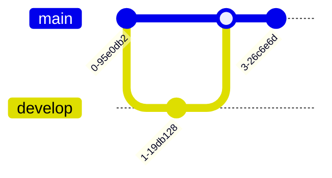

# Mermaid Diagram Reference

Quick reference for Mermaid diagram syntax and patterns.

## Diagram Types

### 1. Flowchart


**Syntax**:
```
flowchart TD      # Top-Down
flowchart LR      # Left-Right
flowchart BT      # Bottom-Top
flowchart RL      # Right-Left
```

**Node Shapes**:
```
A[Rectangle]
B(Rounded)
C([Stadium])
D[[Subroutine]]
E[(Database)]
F((Circle))
G>Asymmetric]
H{Diamond}
I{{Hexagon}}
J[/Parallelogram/]
K[\Parallelogram\]
L[/Trapezoid\]
M[\Trapezoid/]
```

**Arrows**:
```
A --> B           # Solid arrow
A --- B           # Solid line
A -.-> B          # Dotted arrow
A ==> B           # Thick arrow
A <--> B          # Bidirectional
A --text--> B     # Labeled arrow
```

### 2. Sequence Diagram


**Syntax**:
```
participant Name as Alias
actor Name              # Actor icon
participant Name        # Box icon

A->>B: Message          # Solid arrow
A-->>B: Dashed          # Dashed arrow
A-xB: Cross             # Cross end
A-)B: Open arrow        # Open arrow

activate A
deactivate A

Note left of A: Note
Note right of B: Note
Note over A,B: Note spanning

loop Loop text
    A->>B: Message
end

alt Alternative
    A->>B: Option 1
else
    A->>B: Option 2
end

opt Optional
    A->>B: Maybe
end

par Parallel
    A->>B: Task 1
and
    A->>C: Task 2
end
```

### 3. Class Diagram


**Syntax**:
```
class ClassName {
    +Public member
    -Private member
    #Protected member
    ~Package member

    +method() ReturnType
    method(param) ReturnType$  # Static
    method() ReturnType*       # Abstract
}

# Relationships
A <|-- B      # Inheritance
A *-- B       # Composition
A o-- B       # Aggregation
A --> B       # Association
A -- B        # Link
A ..> B       # Dependency
A ..|> B      # Realization

# Cardinality
A "1" --> "0..*" B
```

### 4. State Diagram


**Syntax**:
```
[*] --> State1          # Initial state
State1 --> [*]          # Final state
State1 --> State2: event

state State1 {
    [*] --> SubState1
    SubState1 --> SubState2
}

note right of State1
    Important note
end note
```

### 5. Entity Relationship Diagram


**Syntax**:
```
ENTITY1 ||--o| ENTITY2 : "relationship"

# Cardinality
||--||  # One to one
}|--||  # Zero or more to one
||--o|  # One to zero or one
}|--o|  # Zero or more to zero or one
```

### 6. Gantt Chart


### 7. Pie Chart


### 8. Git Graph



## Styling

### Theme Selection


Themes: `default`, `dark`, `forest`, `neutral`

### Custom Styles


### Subgraphs


## Advanced Features

### Callbacks (HTML Only)


### Comments

```mermaid
%% This is a comment
graph TD
    A --> B  %% This is also a comment
```

### Configuration


## Best Practices

### 1. Keep It Simple

```mermaid
%% Good: Simple and clear
flowchart TD
    A[User] --> B[System]
    B --> C[Database]

%% Bad: Too complex for one diagram
flowchart TD
    A[User] --> B[Auth Service]
    B --> C[User Service]
    C --> D[Database]
    B --> E[Cache]
    C --> F[Message Queue]
    F --> G[Worker 1]
    F --> H[Worker 2]
    %% ... 20 more nodes
```

### 2. Use Descriptive Labels

```mermaid
%% Good: Descriptive
flowchart TD
    User[Web Browser] --> Server[Application Server]
    Server --> DB[(PostgreSQL Database)]

%% Bad: Generic
flowchart TD
    A --> B
    B --> C
```

### 3. Group Related Components


### 4. Use Consistent Styling


## Mermaid CLI Usage

### Installation

```bash
npm install -g @mermaid-js/mermaid-cli
```

### Generate Images

```bash
# PNG output
mmdc -i diagram.mmd -o diagram.png

# SVG output
mmdc -i diagram.mmd -o diagram.svg

# PDF output
mmdc -i diagram.mmd -o diagram.pdf

# Custom dimensions
mmdc -i diagram.mmd -o diagram.png -w 1920 -H 1080

# Dark theme
mmdc -i diagram.mmd -o diagram.png -t dark

# Custom background
mmdc -i diagram.mmd -o diagram.png -b transparent
```

### Batch Processing

```bash
# Process all .mmd files
for file in *.mmd; do
    mmdc -i "$file" -o "${file%.mmd}.svg"
done
```

## Integration

### Markdown

````markdown

````

### HTML

```html
<div class="mermaid">
graph TD
    A --> B
</div>

<script src="https://cdn.jsdelivr.net/npm/mermaid/dist/mermaid.min.js"></script>
<script>mermaid.initialize({startOnLoad:true});</script>
```

### Programmatic

```javascript
const mermaid = require('mermaid');

mermaid.initialize({ startOnLoad: true });

// Or render specific element
mermaid.render('graphDiv', 'graph TD\nA-->B', (svgCode) => {
    document.getElementById('output').innerHTML = svgCode;
});
```

## Common Patterns for Ladybird

### Multi-Process Architecture


### Request Flow

```mermaid
sequenceDiagram
    UI->>WebContent: Navigate
    WebContent->>RequestServer: HTTP Request
    RequestServer->>Network: TCP/TLS
    Network-->>RequestServer: Response
    RequestServer-->>WebContent: Data
    WebContent->>WebContent: Parse & Render
    WebContent-->>UI: Update Display
```

### State Machines

```mermaid
stateDiagram-v2
    [*] --> Idle
    Idle --> Loading: start_load()
    Loading --> Parsing: response_received()
    Parsing --> Rendering: dom_ready()
    Rendering --> Complete: paint_complete()
    Complete --> [*]
```

## Resources

- **Live Editor**: https://mermaid.live/
- **Documentation**: https://mermaid.js.org/
- **GitHub**: https://github.com/mermaid-js/mermaid
- **CLI Tool**: https://github.com/mermaid-js/mermaid-cli
