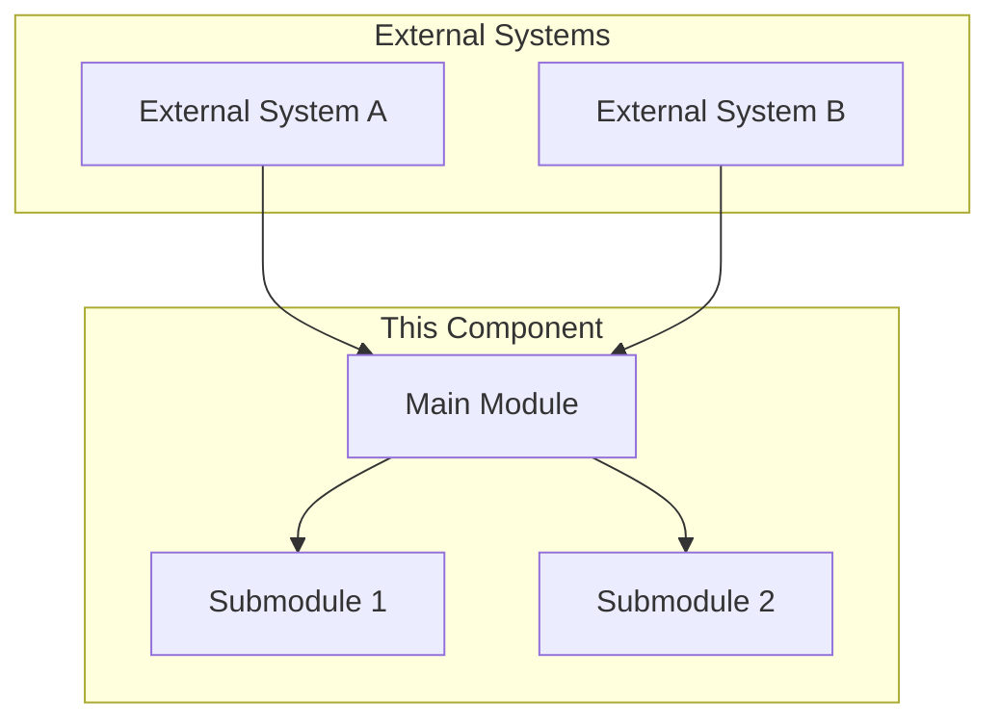
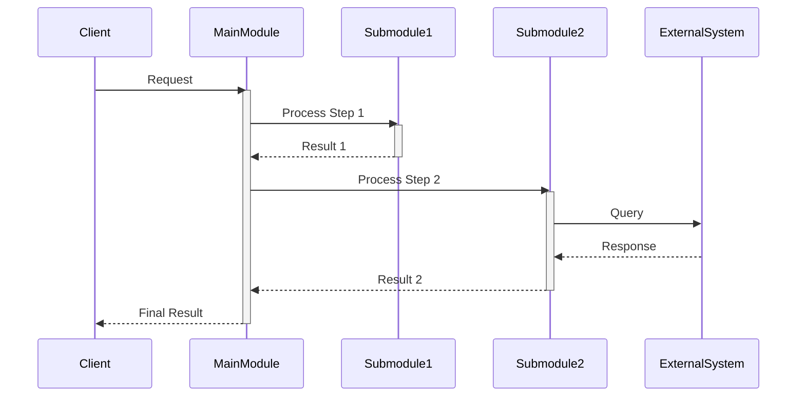
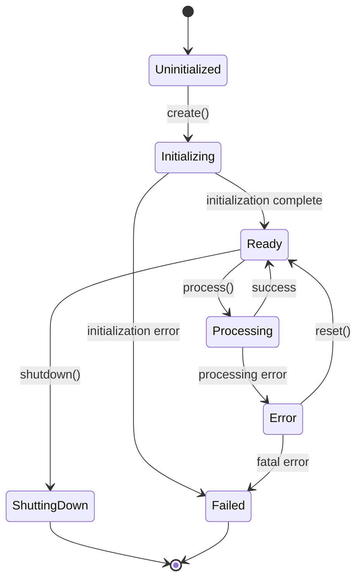
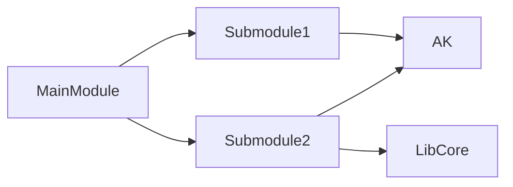

# [Component Name] Architecture

## Overview

Brief overview of the component (2-3 paragraphs):
- What is this component?
- What problem does it solve?
- How does it fit into the larger system?

### Key Responsibilities

- **Responsibility 1**: Description of what this component handles
- **Responsibility 2**: Another key function
- **Responsibility 3**: Additional responsibility

### Design Goals

1. **Goal 1**: Why this architectural decision was made
2. **Goal 2**: Trade-offs considered
3. **Goal 3**: Non-goals (what this component explicitly does NOT do)

## High-Level Architecture



## Components

### Main Module

**Purpose**: Primary component that coordinates overall functionality

**Location**: `Path/To/MainModule.cpp`

**Key Classes**:
- `MainClass` - Core logic
- `HelperClass` - Supporting functionality

**Responsibilities**:
1. Coordinate submodules
2. Handle external communication
3. Manage lifecycle

### Submodule 1

**Purpose**: Handles specific functionality X

**Location**: `Path/To/Submodule1/`

**Dependencies**:
- `AK` - Core data structures
- `LibCore` - Event loop
- External library Y

## Data Flow



### Request Processing Flow

1. **Request Reception**
   - Client submits request to MainModule
   - Input validation performed
   - Request logged for debugging

2. **Processing Pipeline**
   - Submodule1 performs preliminary processing
   - Results passed to Submodule2
   - External systems consulted if needed

3. **Response Generation**
   - Results aggregated by MainModule
   - Response formatted according to client preferences
   - Response sent back to client

## State Management



### State Descriptions

- **Uninitialized**: Component not yet created
- **Initializing**: Resources being allocated, configuration loaded
- **Ready**: Component ready to process requests
- **Processing**: Actively handling a request
- **Error**: Recoverable error state, can be reset
- **Failed**: Unrecoverable error, requires restart
- **ShuttingDown**: Cleanup in progress

## Threading Model

### Thread Safety

- **MainModule**: Thread-safe, uses internal locking
- **Submodule1**: Not thread-safe, must be called from main thread only
- **Submodule2**: Thread-safe, reentrant

### Concurrency Strategy

```cpp
// Example of thread-safe access
class MainModule {
private:
    mutable Mutex m_lock;
    State m_state;

public:
    State state() const {
        Locker locker(m_lock);
        return m_state;
    }
};
```

## Memory Management

### Ownership Model

- **MainModule owns** Submodule1 and Submodule2 (NonnullOwnPtr)
- **Shared resources** use RefPtr for reference counting
- **Temporary allocations** use Vector/String with automatic cleanup

### Memory Layout

```cpp
class MainModule {
private:
    // Owned resources
    NonnullOwnPtr<Submodule1> m_submodule1;
    NonnullOwnPtr<Submodule2> m_submodule2;

    // Shared resources
    RefPtr<SharedCache> m_cache;

    // Value types
    Vector<Request> m_pending_requests;
    HashMap<RequestID, Response> m_responses;
};
```

## Error Handling

### Error Categories

1. **Validation Errors** (`EINVAL`)
   - Invalid input parameters
   - Malformed requests
   - Out-of-range values

2. **Resource Errors** (`ENOMEM`, `ENOENT`)
   - Memory allocation failures
   - Missing configuration files
   - Unavailable external services

3. **State Errors** (`EBUSY`, `EAGAIN`)
   - Operations performed in wrong state
   - Resource conflicts
   - Retry needed

### Error Propagation

```cpp
ErrorOr<Response> MainModule::process(Request const& request)
{
    // Validate input
    TRY(validate_request(request));

    // Process with submodules
    auto intermediate = TRY(m_submodule1->process_step1(request));
    auto result = TRY(m_submodule2->process_step2(intermediate));

    return result;
}
```

## Configuration

### Configuration Options

```cpp
struct ComponentConfig {
    // Required settings
    size_t max_connections;
    Duration timeout;

    // Optional settings (with defaults)
    bool enable_caching { true };
    size_t cache_size { 1024 };
    LogLevel log_level { LogLevel::Info };
};
```

### Configuration Sources

1. **Hardcoded defaults** in code
2. **Configuration file** (`config.json`)
3. **Environment variables** (override file settings)
4. **Runtime API** (override all)

Priority: Runtime API > Environment > Config File > Defaults

## Performance Characteristics

### Time Complexity

| Operation | Time Complexity | Notes |
|-----------|----------------|-------|
| `initialize()` | O(1) | Constant time initialization |
| `process()` | O(n) | Linear in request size |
| `lookup()` | O(log n) | Binary search in cache |
| `shutdown()` | O(n) | Must cleanup all resources |

### Space Complexity

| Data Structure | Space | Purpose |
|----------------|-------|---------|
| Request queue | O(n) | Pending requests |
| Response cache | O(m) | Recent responses |
| Internal state | O(1) | Fixed overhead |

### Performance Benchmarks

Typical performance on modern hardware (Intel i7):

- **Initialization**: <10ms
- **Request processing**: 1-5ms per request
- **Throughput**: ~1000 requests/second
- **Memory usage**: 10MB base + 1KB per request

## Dependencies

### Internal Dependencies



### External Dependencies

- **AK**: Core data structures (Vector, HashMap, String)
- **LibCore**: Event loop, file I/O
- **LibCrypto**: Cryptographic operations (if applicable)
- External Library X v2.0+

## Testing Strategy

### Unit Tests

Location: `Tests/ComponentName/`

```bash
# Run all component tests
./Build/debug/bin/TestComponentName

# Run specific test
./Build/debug/bin/TestComponentName --filter="MainModule.*"
```

### Integration Tests

Scenarios covered:
- End-to-end request processing
- Error recovery
- Concurrent access
- Configuration changes

### Performance Tests

Benchmarks for:
- Throughput under load
- Memory usage over time
- Response latency distribution

## Monitoring and Observability

### Logging

```cpp
// Debug logging (verbose)
dbgln("ComponentName: Processing request {}", request_id);

// Info logging (important events)
warnln("ComponentName: Cache miss for key {}", key);

// Error logging (failures)
warnln("ComponentName: Failed to process: {}", error);
```

### Metrics

Key metrics to monitor:
- **Request rate**: Requests per second
- **Error rate**: Percentage of failed requests
- **Latency**: p50, p95, p99 response times
- **Memory usage**: Current and peak

## Security Considerations

### Threat Model

Potential threats:
1. **Malicious input**: Crafted requests to trigger vulnerabilities
2. **Resource exhaustion**: Overwhelming with requests
3. **Information leakage**: Error messages revealing internals

### Mitigations

- **Input validation**: Strict validation of all inputs
- **Rate limiting**: Limit requests per client
- **Error sanitization**: Generic error messages to clients
- **Memory limits**: Bounded allocations

## Future Improvements

### Short-term (Next Release)

- [ ] Improve error messages with better context
- [ ] Add performance metrics collection
- [ ] Optimize cache eviction strategy

### Long-term (Future Versions)

- [ ] Support for streaming requests
- [ ] Distributed operation across multiple processes
- [ ] Machine learning-based optimization

### Non-goals

- X feature is explicitly out of scope
- Y functionality should be handled by another component

## References

### Related Documentation

- [Component B Architecture](ComponentB.md) - Complementary functionality
- [API Reference](../API.md) - Detailed API documentation
- [User Guide](../UserGuide.md) - How to use this component

### External Resources

- [Relevant Specification](https://spec.example.org) - If implementing a standard
- [Design Pattern](https://example.com/pattern) - Architectural pattern used
- [Performance Guide](https://example.com/perf) - Optimization techniques

## Changelog

### Version 1.2.0 (Current)
- Added support for feature X
- Improved performance by 30%
- Fixed memory leak in error path

### Version 1.1.0
- Initial stable release
- Core functionality complete

---

**Document Metadata**
- **Version**: 1.2.0
- **Last Updated**: 2025-11-01
- **Author**: Component Team
- **Reviewers**: Architecture Team
