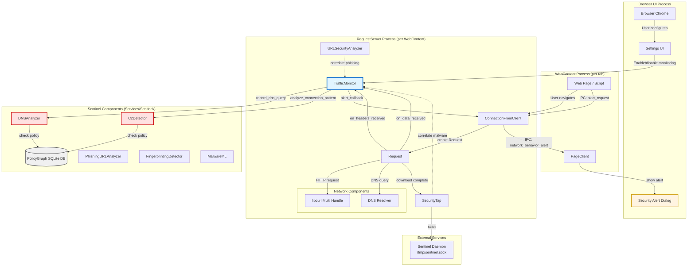
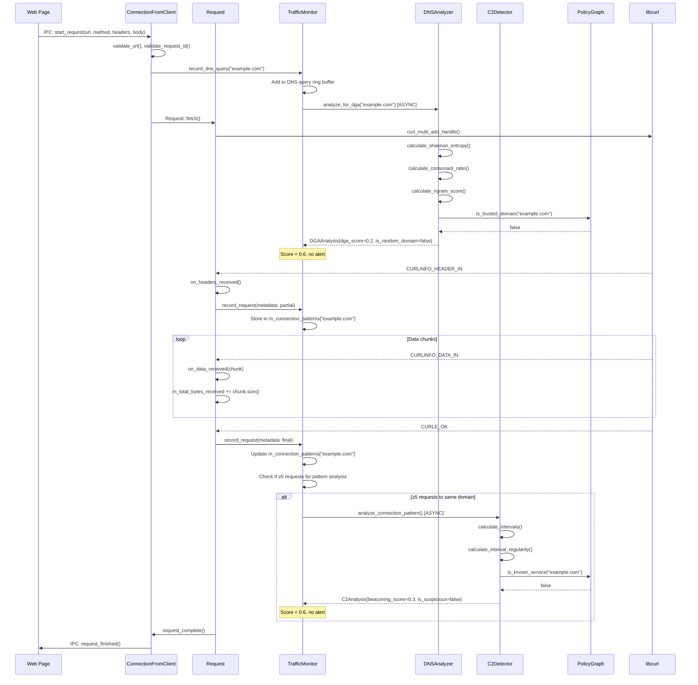
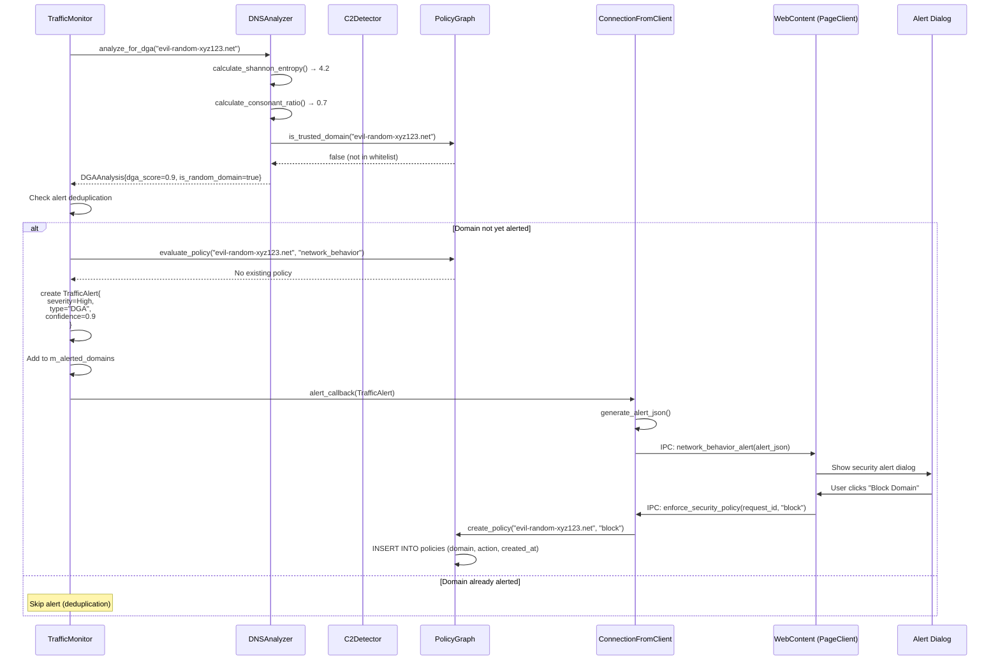
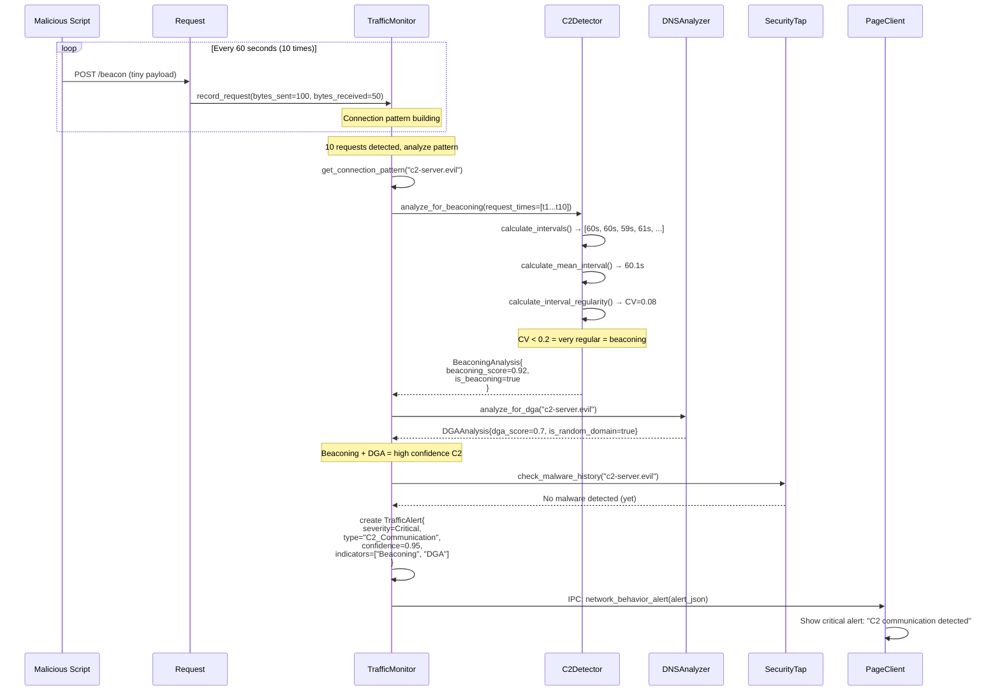
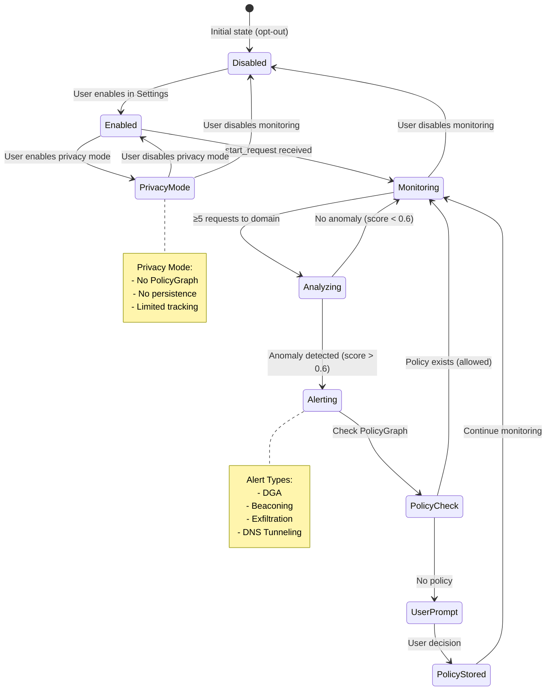
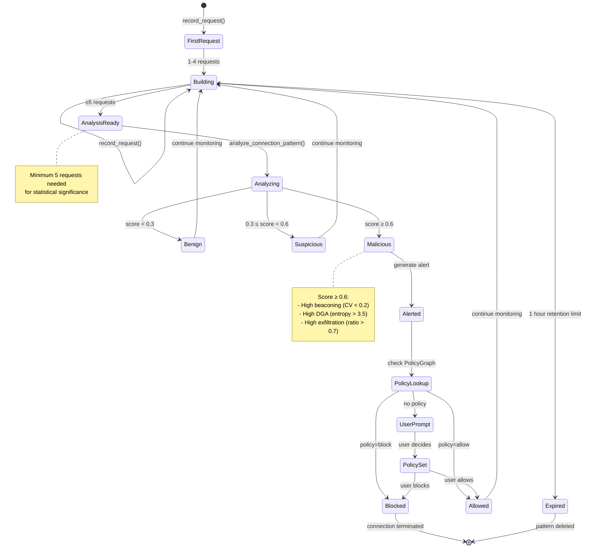
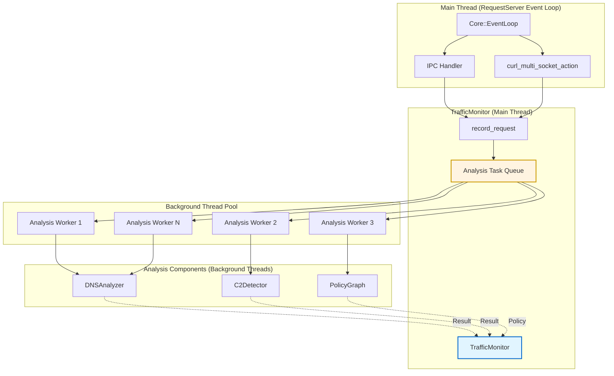
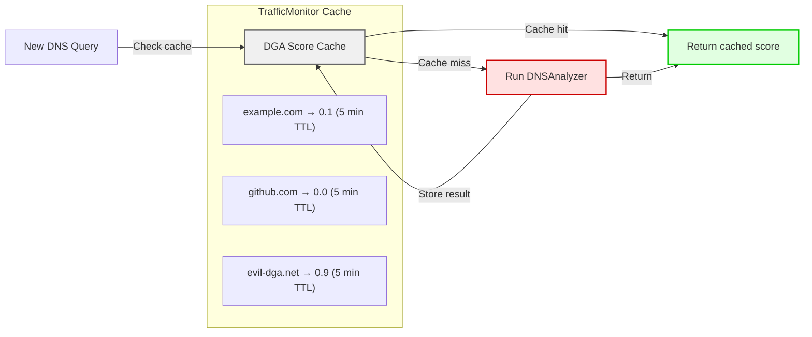
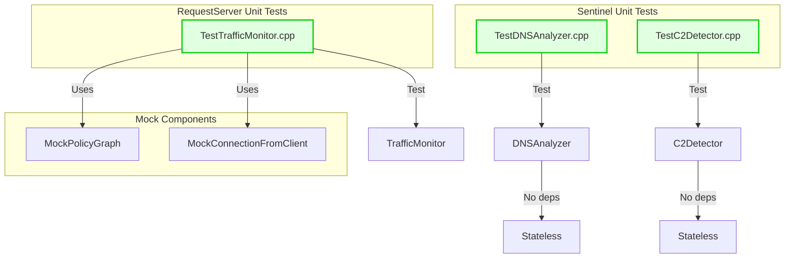

# Phase 6: Network Behavioral Analysis - Detailed Architecture Diagrams

**Companion Document**: PHASE_6_NETWORK_BEHAVIORAL_ANALYSIS_ARCHITECTURE.md
**Version**: 1.0
**Date**: 2025-11-01

This document provides detailed architectural diagrams for the Phase 6 Network Behavioral Analysis system.

---

## 1. System Architecture Overview



---

## 2. Component Interaction Matrix

| Component | Calls | Called By | Data Flow |
|-----------|-------|-----------|-----------|
| **TrafficMonitor** | DNSAnalyzer, C2Detector, PolicyGraph | ConnectionFromClient, Request | RequestMetadata → Analysis Results |
| **DNSAnalyzer** | PolicyGraph | TrafficMonitor | Domain → DGAAnalysis |
| **C2Detector** | PolicyGraph | TrafficMonitor | ConnectionPattern → C2Analysis |
| **PolicyGraph** | (SQLite DB) | TrafficMonitor, DNSAnalyzer, C2Detector | Domain → Policy Decision |
| **ConnectionFromClient** | TrafficMonitor, Request | PageClient (IPC) | URL → TrafficAlert |
| **Request** | TrafficMonitor | ConnectionFromClient | Lifecycle events → RequestMetadata |

---

## 3. Detailed Data Flow Diagrams

### 3.1 Full Request Lifecycle with Monitoring



### 3.2 Alert Generation Flow



### 3.3 Beaconing Detection with Correlation



---

## 4. Component State Machines

### 4.1 TrafficMonitor State Machine



### 4.2 Connection Pattern State Machine



---

## 5. Data Structure Diagrams

### 5.1 TrafficMonitor Memory Layout

```
TrafficMonitor
├── m_connection_patterns: HashMap<String, ConnectionPattern>
│   ├── "example.com" → ConnectionPattern {
│   │   request_count: 15,
│   │   bytes_sent: 50000,
│   │   bytes_received: 200000,
│   │   request_times: [t1, t2, ..., t15],
│   │   intervals: [Δt1, Δt2, ..., Δt14],
│   │   first_seen: 2025-11-01 12:00:00,
│   │   last_seen: 2025-11-01 12:15:00
│   │   }
│   ├── "api.github.com" → ConnectionPattern { ... }
│   └── ... (max 500 patterns, LRU eviction)
│
├── m_dns_queries: Vector<DNSQuery> (ring buffer, max 1000)
│   ├── [0] → DNSQuery { domain: "example.com", timestamp: t1 }
│   ├── [1] → DNSQuery { domain: "evil-dga.net", timestamp: t2 }
│   └── ...
│
├── m_alerted_domains: HashTable<String>
│   ├── "evil-dga.net"
│   ├── "c2-server.net"
│   └── ... (session-only, not persisted)
│
├── m_dns_analyzer: NonnullOwnPtr<DNSAnalyzer>
├── m_c2_detector: NonnullOwnPtr<C2Detector>
├── m_policy_graph: OwnPtr<PolicyGraph>  // nullable
├── m_monitoring_enabled: bool
├── m_privacy_mode: bool
└── m_stats: Statistics
```

### 5.2 ConnectionPattern Structure

```cpp
struct ConnectionPattern {
    String domain;                     // "example.com"
    u64 request_count;                 // Total requests
    u64 bytes_sent;                    // Total uploaded
    u64 bytes_received;                // Total downloaded
    Vector<UnixDateTime> request_times; // Timestamps (for interval analysis)
    Vector<Duration> intervals;        // Time between requests
    UnixDateTime first_seen;           // First request time
    UnixDateTime last_seen;            // Most recent request time
    bool is_websocket;                 // WebSocket connection flag

    // Computed properties
    Duration lifetime() const {
        return last_seen - first_seen;
    }

    float upload_ratio() const {
        auto total = bytes_sent + bytes_received;
        return total > 0 ? (float)bytes_sent / total : 0.0f;
    }

    float requests_per_minute() const {
        auto minutes = lifetime().to_seconds() / 60.0;
        return minutes > 0 ? request_count / minutes : 0.0f;
    }
};
```

### 5.3 PolicyGraph Schema (Network Behavior Policies)

```sql
-- Existing tables from previous milestones
-- policies, trusted_form_relationships, quarantine_entries

-- New table for network behavior policies
CREATE TABLE network_behavior_policies (
    id INTEGER PRIMARY KEY AUTOINCREMENT,
    domain TEXT NOT NULL UNIQUE,              -- "evil-c2.net"
    action TEXT NOT NULL,                     -- "allow", "block", "alert"
    reason TEXT,                              -- "User allowed", "DGA detected", etc.
    confidence REAL,                          -- Detection confidence (0.0-1.0)
    alert_type TEXT,                          -- "DGA", "Beaconing", "Exfiltration", etc.
    created_at INTEGER NOT NULL,              -- Unix timestamp
    expires_at INTEGER,                       -- Optional expiration (NULL = never)
    user_created BOOLEAN DEFAULT 1            -- 1 = user decision, 0 = auto
);

CREATE INDEX idx_network_behavior_domain ON network_behavior_policies(domain);
CREATE INDEX idx_network_behavior_expires ON network_behavior_policies(expires_at);

-- Query examples
-- Insert user decision
INSERT INTO network_behavior_policies (domain, action, reason, created_at)
VALUES ('evil-c2.net', 'block', 'User blocked after C2 alert', 1730473200);

-- Check existing policy
SELECT action, reason FROM network_behavior_policies
WHERE domain = 'evil-c2.net' AND (expires_at IS NULL OR expires_at > 1730473200);

-- Cleanup expired policies
DELETE FROM network_behavior_policies WHERE expires_at IS NOT NULL AND expires_at < 1730473200;
```

---

## 6. Threading and Concurrency Model

### 6.1 Thread Architecture



### 6.2 Concurrency Safety

| Component | Thread Safety | Synchronization |
|-----------|---------------|-----------------|
| **TrafficMonitor** | Main thread only | No locks needed (event loop) |
| **m_connection_patterns** | Main thread only | No locks needed |
| **m_dns_queries** | Main thread only | No locks needed |
| **DNSAnalyzer** | Thread-safe (stateless) | No shared state |
| **C2Detector** | Thread-safe (stateless) | No shared state |
| **PolicyGraph** | Thread-safe (SQLite) | SQLite internal locking |
| **Analysis Task Queue** | Multi-producer, multi-consumer | Mutex + condition variable |

**Design Principle**: Minimize locking by keeping TrafficMonitor state in main thread and using stateless analyzers in background threads.

### 6.3 Async Analysis Flow

```cpp
// Main thread (event loop)
void TrafficMonitor::record_request(RequestMetadata const& metadata)
{
    // Update connection pattern (fast, main thread)
    auto& pattern = m_connection_patterns.ensure(metadata.url.host()->serialize());
    pattern.request_count++;
    pattern.bytes_sent += metadata.bytes_sent;
    pattern.bytes_received += metadata.bytes_received;
    pattern.request_times.append(metadata.start_time);

    // Queue async analysis (if enough data)
    if (pattern.request_count >= 5) {
        enqueue_analysis_task([this, domain = metadata.url.host()->serialize()]() {
            // Background thread
            auto analysis = m_c2_detector->analyze_connection_pattern(
                domain,
                get_pattern(domain).request_count,
                get_pattern(domain).bytes_sent,
                get_pattern(domain).bytes_received,
                get_pattern(domain).request_times
            );

            // Return to main thread for alert
            Core::EventLoop::current().post_event([this, domain, analysis]() {
                on_analysis_complete(domain, analysis);
            });
        });
    }
}
```

---

## 7. Performance Optimization Strategies

### 7.1 Caching Strategy



**Cache Implementation**:

```cpp
class TrafficMonitor {
private:
    struct CachedAnalysis {
        DNSAnalyzer::DGAAnalysis dga;
        UnixDateTime cached_at;
        static constexpr Duration TTL = Duration::from_seconds(300);  // 5 minutes

        bool is_expired() const {
            return (UnixDateTime::now() - cached_at) > TTL;
        }
    };

    HashMap<String, CachedAnalysis> m_analysis_cache;

    ErrorOr<DNSAnalyzer::DGAAnalysis> get_or_analyze_dga(StringView domain)
    {
        // Check cache
        if (auto cached = m_analysis_cache.get(domain)) {
            if (!cached->is_expired()) {
                m_stats.cache_hits++;
                return cached->dga;
            }
            m_analysis_cache.remove(domain);  // Expired
        }

        // Cache miss - analyze
        m_stats.cache_misses++;
        auto analysis = TRY(m_dns_analyzer->analyze_for_dga(domain));
        m_analysis_cache.set(domain, CachedAnalysis{
            .dga = analysis,
            .cached_at = UnixDateTime::now()
        });

        return analysis;
    }
};
```

### 7.2 Sampling Strategy (High-Traffic Sites)

```cpp
void TrafficMonitor::record_request(RequestMetadata const& metadata)
{
    auto domain = metadata.url.host()->serialize();
    auto& pattern = m_connection_patterns.ensure(domain);

    // Always record basic stats
    pattern.request_count++;
    pattern.bytes_sent += metadata.bytes_sent;
    pattern.bytes_received += metadata.bytes_received;

    // High-traffic site detection (>100 requests/min)
    if (pattern.requests_per_minute() > 100.0f) {
        // Sample 10% of requests for analysis
        if (AK::get_random_uniform(100) < 10) {
            pattern.request_times.append(metadata.start_time);
        }
        // Note: Still track byte counts for all requests
    } else {
        // Normal traffic - track all requests
        pattern.request_times.append(metadata.start_time);
    }
}
```

### 7.3 Memory Management (LRU Eviction)

```cpp
void TrafficMonitor::record_request(RequestMetadata const& metadata)
{
    auto domain = metadata.url.host()->serialize();

    // Check capacity
    if (m_connection_patterns.size() >= MaxConnectionPatterns) {
        // Evict least recently used (LRU)
        auto oldest_domain = find_oldest_pattern();
        m_connection_patterns.remove(oldest_domain);
    }

    auto& pattern = m_connection_patterns.ensure(domain);
    pattern.last_seen = UnixDateTime::now();  // Update LRU timestamp
    // ... rest of recording
}

String TrafficMonitor::find_oldest_pattern() const
{
    String oldest_domain;
    UnixDateTime oldest_time = UnixDateTime::now();

    for (auto const& [domain, pattern] : m_connection_patterns) {
        if (pattern.last_seen < oldest_time) {
            oldest_time = pattern.last_seen;
            oldest_domain = domain;
        }
    }

    return oldest_domain;
}
```

---

## 8. Error Handling and Graceful Degradation

### 8.1 Initialization Failure Handling

```cpp
// RequestServer/ConnectionFromClient.cpp
ConnectionFromClient::ConnectionFromClient(NonnullOwnPtr<IPC::Transport> transport)
{
    // Try to create TrafficMonitor
    auto traffic_monitor = TrafficMonitor::create();
    if (traffic_monitor.is_error()) {
        dbgln("Warning: Failed to initialize TrafficMonitor: {}", traffic_monitor.error());
        m_traffic_monitor = nullptr;
        // Browser continues working normally without network monitoring
    } else {
        m_traffic_monitor = traffic_monitor.release_value();
        dbgln("TrafficMonitor initialized successfully");
    }
}

// Sentinel/DNSAnalyzer.cpp
ErrorOr<NonnullOwnPtr<DNSAnalyzer>> DNSAnalyzer::create()
{
    auto analyzer = adopt_nonnull_own_or_enomem(new (nothrow) DNSAnalyzer());
    if (!analyzer)
        return Error::from_errno(ENOMEM);

    // Load popular domains whitelist
    auto popular = TRY(load_popular_domains());
    if (popular.is_empty()) {
        dbgln("Warning: Failed to load popular domains whitelist");
        // Continue with empty whitelist (may have more false positives)
    }

    return analyzer;
}
```

### 8.2 Analysis Failure Handling

```cpp
void TrafficMonitor::analyze_domain(StringView domain)
{
    // DNS analysis
    auto dga_result = m_dns_analyzer->analyze_for_dga(domain);
    if (dga_result.is_error()) {
        dbgln("Warning: DGA analysis failed for '{}': {}", domain, dga_result.error());
        // Continue without DGA detection for this domain
        return;
    }

    auto dga_analysis = dga_result.release_value();

    // Only proceed if suspicious
    if (dga_analysis.dga_score < 0.6f)
        return;

    // Generate alert (even if some analysis failed)
    TrafficAlert alert {
        .severity = TrafficAlert::Severity::High,
        .alert_type = "DGA"_string,
        .domain = String::from_utf8(domain).release_value_but_fixme_should_propagate_errors(),
        .explanation = dga_analysis.explanation,
        .confidence = dga_analysis.dga_score,
        .detected_at = UnixDateTime::now()
    };

    if (m_alert_callback)
        m_alert_callback(alert);
}
```

---

## 9. Testing Strategy Architecture

### 9.1 Unit Test Architecture



### 9.2 Integration Test Scenarios

| Test Scenario | Components | Expected Result |
|---------------|------------|-----------------|
| **DGA Detection** | TrafficMonitor + DNSAnalyzer | Alert generated, score > 0.7 |
| **Beaconing Detection** | TrafficMonitor + C2Detector | Alert after 5 regular requests |
| **Exfiltration Detection** | TrafficMonitor + C2Detector | Alert when upload ratio > 0.7 |
| **Whitelist Enforcement** | DNSAnalyzer + PolicyGraph | No alert for google.com, github.com |
| **Privacy Mode** | TrafficMonitor | No PolicyGraph writes |
| **Alert Deduplication** | TrafficMonitor | Only 1 alert per domain per session |
| **Cache Effectiveness** | TrafficMonitor | >80% cache hit rate |
| **Graceful Degradation** | All components | Browser works if monitoring fails |

---

## 10. Deployment Architecture

### 10.1 Configuration Files

```
/etc/ladybird/
├── sentinel.conf                # Sentinel daemon config
└── network-monitoring.conf      # TrafficMonitor config

~/.config/ladybird/
├── policies.db                  # PolicyGraph SQLite database
└── network-monitoring-prefs.json  # User preferences

/usr/share/ladybird/
├── popular-domains.txt          # Top 1000 domains whitelist
└── upload-services.txt          # Known upload services (CDNs, cloud)
```

**network-monitoring.conf**:

```ini
[TrafficMonitor]
enabled=true
privacy_mode=false
max_connection_patterns=500
max_dns_queries=1000
pattern_retention_hours=1
cache_ttl_seconds=300

[DNSAnalyzer]
dga_entropy_threshold=3.5
dga_consonant_threshold=0.6
tunneling_length_threshold=50
tunneling_frequency_threshold=10

[C2Detector]
beaconing_regularity_threshold=0.2
exfiltration_upload_ratio_threshold=0.7
exfiltration_min_bytes=10485760
port_scan_port_threshold=5
```

### 10.2 Resource Limits

| Resource | Limit | Rationale |
|----------|-------|-----------|
| Memory | <1MB per RequestServer | 500 patterns + 1000 DNS queries |
| CPU | <1% sustained | Async analysis, background threads |
| Disk | <10MB (PolicyGraph) | SQLite database |
| Network | 0 bytes | Local-only analysis |
| File descriptors | +0 | No additional files |

---

## Conclusion

This architecture provides a comprehensive, privacy-preserving network behavioral analysis system that:
- Detects DGA domains, beaconing, exfiltration, and DNS tunneling
- Operates entirely on-device with no external communication
- Maintains <5% performance overhead through async analysis and caching
- Integrates seamlessly with existing Sentinel components
- Supports graceful degradation if monitoring fails or is disabled

The design follows established Ladybird patterns and is ready for implementation in Phase 6A-6E.

---

*Companion Document*: PHASE_6_NETWORK_BEHAVIORAL_ANALYSIS_ARCHITECTURE.md
*Version*: 1.0
*Date*: 2025-11-01
