# Phase 6: Network Behavioral Analysis Architecture

**Version**: 1.0
**Date**: 2025-11-01
**Status**: Architecture Design - Implementation Ready
**Milestone**: 0.4 Advanced Threat Detection

---

## Executive Summary

Phase 6 implements network behavioral analysis to detect malicious traffic patterns including:
- **Command & Control (C2) communication detection** via beaconing and interval analysis
- **Domain Generation Algorithm (DGA) detection** using entropy and character distribution
- **DNS tunneling detection** via query pattern analysis
- **Data exfiltration detection** via upload/download ratio anomalies
- **Port scanning and reconnaissance detection** via connection pattern analysis

The architecture follows established Sentinel patterns:
1. **Core logic** in `Services/Sentinel/` (detector components)
2. **Integration layer** in `Services/RequestServer/` (traffic monitoring)
3. **Privacy-first design** with opt-in, local-only analysis
4. **Graceful degradation** if initialization fails
5. **Performance budget** <5% overhead on page load

Unlike browser fingerprinting or phishing detection (which are per-page), network behavioral analysis operates at the **RequestServer level** to track cross-domain patterns that indicate malware communication.

---

## 1. Component Architecture

### 1.1 High-Level Architecture


### 1.2 Component Responsibilities

| Component | Location | Responsibilities |
|-----------|----------|------------------|
| **TrafficMonitor** | `Services/RequestServer/` | Traffic event aggregation, connection pattern tracking, alert orchestration |
| **DNSAnalyzer** | `Services/Sentinel/` | DNS query analysis, DGA detection, tunneling detection |
| **C2Detector** | `Services/Sentinel/` | Beaconing detection, exfiltration detection, C2 heuristics |
| **PolicyGraph** | `Services/Sentinel/` | Store user decisions, trusted domain whitelist |

---

## 2. Component Details

### 2.1 TrafficMonitor (RequestServer Integration Layer)

**Location**: `Services/RequestServer/TrafficMonitor.{h,cpp}`

**Purpose**: Aggregate network events from all requests and route to appropriate analyzers.

**Responsibilities**:
- Track all HTTP/HTTPS requests with timing and byte counts
- Maintain per-domain connection statistics
- Detect DNS queries (from URL hostnames)
- Coordinate async analysis with DNSAnalyzer and C2Detector
- Generate alerts when anomalies detected
- Enforce privacy controls (opt-in, data retention limits)

**Key Interfaces**:

```cpp
namespace RequestServer {

class TrafficMonitor {
public:
    static ErrorOr<NonnullOwnPtr<TrafficMonitor>> create();
    ~TrafficMonitor() = default;

    // Network event recording (called by Request lifecycle)
    struct RequestMetadata {
        URL::URL url;
        ByteString method;
        u64 bytes_sent { 0 };
        u64 bytes_received { 0 };
        UnixDateTime start_time;
        Duration request_duration;
        u16 response_status { 0 };
        bool is_websocket { false };
    };

    void record_request(RequestMetadata const& metadata);
    void record_dns_query(StringView domain);
    void record_websocket_data(URL::URL const& url, u64 bytes_sent, u64 bytes_received);

    // Analysis triggers (async, non-blocking)
    void analyze_domain(StringView domain);
    void analyze_connection_pattern(StringView domain);
    void analyze_traffic_anomalies();

    // Alert management
    struct TrafficAlert {
        enum class Severity {
            Low,        // FYI, informational
            Medium,     // Suspicious, worth investigating
            High,       // Likely malicious, block recommended
            Critical    // Active C2/exfiltration, block immediately
        };

        Severity severity { Severity::Low };
        String alert_type;  // "DGA", "Beaconing", "Exfiltration", "DNS_Tunneling"
        String domain;
        String explanation;
        float confidence { 0.0f };  // 0.0-1.0
        Vector<String> indicators;  // Evidence list
        UnixDateTime detected_at;
    };

    using AlertCallback = Function<void(TrafficAlert const&)>;
    void set_alert_callback(AlertCallback callback);

    // Configuration
    void enable_monitoring(bool enabled);
    bool is_monitoring_enabled() const { return m_monitoring_enabled; }

    void set_privacy_mode(bool enabled);  // Strict privacy: no persistence, limited tracking
    bool is_privacy_mode() const { return m_privacy_mode; }

    // Statistics
    struct Statistics {
        u64 total_requests { 0 };
        u64 total_bytes_sent { 0 };
        u64 total_bytes_received { 0 };
        u64 unique_domains { 0 };
        u64 dns_queries { 0 };
        u64 alerts_generated { 0 };
        u64 dga_detections { 0 };
        u64 beaconing_detections { 0 };
        u64 exfiltration_detections { 0 };
        u64 dns_tunneling_detections { 0 };
    };

    Statistics get_statistics() const;
    void reset_statistics();

private:
    TrafficMonitor(
        NonnullOwnPtr<Sentinel::DNSAnalyzer> dns_analyzer,
        NonnullOwnPtr<Sentinel::C2Detector> c2_detector,
        OwnPtr<Sentinel::PolicyGraph> policy_graph
    );

    // Connection pattern tracking
    struct ConnectionPattern {
        String domain;
        u64 request_count { 0 };
        u64 bytes_sent { 0 };
        u64 bytes_received { 0 };
        Vector<UnixDateTime> request_times;
        Vector<Duration> intervals;
        UnixDateTime first_seen;
        UnixDateTime last_seen;
        bool is_websocket { false };
    };

    HashMap<String, ConnectionPattern> m_connection_patterns;

    // DNS query tracking (separate from HTTP requests)
    struct DNSQuery {
        String domain;
        UnixDateTime timestamp;
    };
    Vector<DNSQuery> m_dns_queries;  // Ring buffer, max 1000 entries

    // Alert deduplication (don't spam user with same alert)
    HashTable<String> m_alerted_domains;  // Reset on browser restart

    // Component instances
    NonnullOwnPtr<Sentinel::DNSAnalyzer> m_dns_analyzer;
    NonnullOwnPtr<Sentinel::C2Detector> m_c2_detector;
    OwnPtr<Sentinel::PolicyGraph> m_policy_graph;  // Optional, for user decisions

    // Configuration
    bool m_monitoring_enabled { true };   // Can be disabled by user
    bool m_privacy_mode { false };        // Strict privacy: no persistence
    AlertCallback m_alert_callback;

    // Statistics
    Statistics m_stats;

    // Privacy enforcement: data retention limits
    static constexpr size_t MaxDNSQueryHistory = 1000;
    static constexpr size_t MaxConnectionPatterns = 500;
    static constexpr Duration PatternRetention = Duration::from_seconds(3600);  // 1 hour
};

}
```

**Integration Points**:
1. **Request Lifecycle Hooks**:
   - `Request::on_headers_received()` → `TrafficMonitor::record_request()`
   - `Request::on_data_received()` → Update byte counters
   - `Request::~Request()` → Final record with total bytes
   - `WebSocket::on_message()` → `TrafficMonitor::record_websocket_data()`

2. **DNS Query Detection**:
   - Extract domain from `URL::URL` in `ConnectionFromClient::start_request()`
   - Call `TrafficMonitor::record_dns_query()` before DNS resolution

3. **Alert Flow**:
   - TrafficMonitor detects anomaly → `m_alert_callback(alert)`
   - ConnectionFromClient receives alert → IPC `network_behavior_alert(alert_json)`
   - WebContent displays alert UI (browser chrome integration)

---

### 2.2 DNSAnalyzer (DGA & DNS Tunneling Detection)

**Location**: `Services/Sentinel/DNSAnalyzer.{h,cpp}`

**Purpose**: Analyze DNS queries for malicious patterns.

**Responsibilities**:
- DGA detection using entropy, character distribution, N-gram analysis
- DNS tunneling detection via query length and frequency
- Subdomain analysis for C2 patterns
- Correlation with known legitimate domains

**Key Interfaces**:

```cpp
namespace Sentinel {

class DNSAnalyzer {
public:
    static ErrorOr<NonnullOwnPtr<DNSAnalyzer>> create();
    ~DNSAnalyzer() = default;

    // DGA Detection
    struct DGAAnalysis {
        float dga_score { 0.0f };       // 0.0-1.0 (1.0 = likely DGA)
        float entropy { 0.0f };         // Shannon entropy (0.0-8.0)
        float consonant_ratio { 0.0f }; // Ratio of consonants (0.0-1.0)
        float vowel_ratio { 0.0f };     // Ratio of vowels (0.0-1.0)
        float digit_ratio { 0.0f };     // Ratio of digits (0.0-1.0)
        bool is_random_domain { false };  // High entropy + unusual patterns
        String explanation;
    };

    ErrorOr<DGAAnalysis> analyze_for_dga(StringView domain);

    // DNS Tunneling Detection
    struct TunnelingAnalysis {
        float tunneling_score { 0.0f };  // 0.0-1.0 (1.0 = likely tunneling)
        float query_length_score { 0.0f };  // Long queries suspicious
        float query_frequency_score { 0.0f }; // High frequency suspicious
        u64 subdomain_count { 0 };
        u64 avg_query_length { 0 };
        String explanation;
    };

    ErrorOr<TunnelingAnalysis> analyze_for_tunneling(
        StringView domain,
        Vector<UnixDateTime> const& query_times
    );

    // Comprehensive DNS Analysis
    struct DNSSecurityAnalysis {
        DGAAnalysis dga;
        TunnelingAnalysis tunneling;
        float overall_risk { 0.0f };  // 0.0-1.0 combined score
        bool is_suspicious { false };  // true if overall_risk > 0.6
        String explanation;
    };

    ErrorOr<DNSSecurityAnalysis> analyze_domain(
        StringView domain,
        Vector<UnixDateTime> const& query_times
    );

    // Whitelisting (reduce false positives)
    void add_trusted_domain(StringView domain);
    void remove_trusted_domain(StringView domain);
    bool is_trusted_domain(StringView domain) const;

    // Popular domain list (preloaded, similar to PhishingURLAnalyzer)
    static Vector<ByteString> const& popular_domains();

private:
    DNSAnalyzer() = default;

    // DGA detection helpers
    static float calculate_shannon_entropy(StringView domain);
    static float calculate_consonant_ratio(StringView domain);
    static float calculate_vowel_ratio(StringView domain);
    static float calculate_digit_ratio(StringView domain);
    static bool is_uniform_distribution(StringView domain);
    static float calculate_ngram_score(StringView domain);  // Bigram/trigram analysis

    // DNS tunneling detection helpers
    static float calculate_query_length_score(StringView domain);
    static float calculate_query_frequency_score(Vector<UnixDateTime> const& query_times);
    static u64 count_subdomains(StringView domain);

    // Whitelist management
    HashTable<String> m_trusted_domains;

    // Statistical thresholds
    static constexpr float DGAEntropyThreshold = 3.5f;      // Shannon entropy
    static constexpr float DGAConsonantThreshold = 0.6f;    // >60% consonants suspicious
    static constexpr float TunnelingLengthThreshold = 50.0f; // >50 chars suspicious
    static constexpr u64 TunnelingFrequencyThreshold = 10;   // >10 queries/min suspicious
};

}
```

**Design Principles**:
1. **Heuristic-Based**: No ML required (simpler, more explainable)
2. **Low False Positives**: Conservative thresholds, popular domain whitelist
3. **Fast**: O(n) analysis where n = domain length (<1ms per domain)
4. **Stateless**: No persistent state required (TrafficMonitor provides history)

**DGA Detection Algorithm**:

```cpp
ErrorOr<DNSAnalyzer::DGAAnalysis> DNSAnalyzer::analyze_for_dga(StringView domain)
{
    DGAAnalysis analysis;

    // Extract domain without TLD (e.g., "google" from "google.com")
    auto domain_parts = domain.split_view('.');
    if (domain_parts.size() < 2) {
        return analysis;  // Too short, not suspicious
    }
    auto domain_name = domain_parts[domain_parts.size() - 2];

    // 1. Shannon entropy (DGA domains have high entropy)
    analysis.entropy = calculate_shannon_entropy(domain_name);
    if (analysis.entropy > DGAEntropyThreshold) {
        analysis.dga_score += 0.4f;
    }

    // 2. Character distribution
    analysis.consonant_ratio = calculate_consonant_ratio(domain_name);
    analysis.vowel_ratio = calculate_vowel_ratio(domain_name);
    analysis.digit_ratio = calculate_digit_ratio(domain_name);

    if (analysis.consonant_ratio > DGAConsonantThreshold) {
        analysis.dga_score += 0.3f;  // Excessive consonants
    }
    if (analysis.vowel_ratio < 0.2f || analysis.vowel_ratio > 0.6f) {
        analysis.dga_score += 0.2f;  // Too few or too many vowels
    }
    if (analysis.digit_ratio > 0.3f) {
        analysis.dga_score += 0.1f;  // Digits in domain name
    }

    // 3. N-gram analysis (unusual character combinations)
    auto ngram_score = calculate_ngram_score(domain_name);
    analysis.dga_score += ngram_score * 0.2f;

    // 4. Check if domain is whitelisted
    if (is_trusted_domain(domain)) {
        analysis.dga_score = 0.0f;  // Override: trusted domain
    }

    analysis.dga_score = min(1.0f, analysis.dga_score);
    analysis.is_random_domain = (analysis.dga_score > 0.7f);

    // Generate explanation
    if (analysis.is_random_domain) {
        analysis.explanation = String::formatted(
            "Domain '{}' exhibits DGA characteristics: entropy={:.2f}, consonants={:.1f}%, vowels={:.1f}%",
            domain_name, analysis.entropy, analysis.consonant_ratio * 100, analysis.vowel_ratio * 100
        );
    }

    return analysis;
}
```

---

### 2.3 C2Detector (Beaconing & Exfiltration Detection)

**Location**: `Services/Sentinel/C2Detector.{h,cpp}`

**Purpose**: Detect Command & Control communication patterns.

**Responsibilities**:
- Beaconing detection (regular interval requests)
- Data exfiltration detection (high upload ratios)
- Port scanning detection (multiple ports on same host)
- Unusual traffic volume detection

**Key Interfaces**:

```cpp
namespace Sentinel {

class C2Detector {
public:
    static ErrorOr<NonnullOwnPtr<C2Detector>> create();
    ~C2Detector() = default;

    // Beaconing Detection
    struct BeaconingAnalysis {
        float beaconing_score { 0.0f };  // 0.0-1.0 (1.0 = likely beaconing)
        float interval_regularity { 0.0f };  // Coefficient of variation (low = regular)
        float mean_interval_seconds { 0.0f };
        u64 request_count { 0 };
        bool is_beaconing { false };  // true if score > 0.7
        String explanation;
    };

    ErrorOr<BeaconingAnalysis> analyze_for_beaconing(
        StringView domain,
        Vector<UnixDateTime> const& request_times
    );

    // Data Exfiltration Detection
    struct ExfiltrationAnalysis {
        float exfiltration_score { 0.0f };  // 0.0-1.0 (1.0 = likely exfiltration)
        float upload_ratio { 0.0f };  // bytes_sent / (bytes_sent + bytes_received)
        u64 total_bytes_sent { 0 };
        u64 total_bytes_received { 0 };
        bool is_upload_heavy { false };  // upload_ratio > 0.7
        bool is_known_upload_service { false };  // CDN, cloud storage, etc.
        String explanation;
    };

    ErrorOr<ExfiltrationAnalysis> analyze_for_exfiltration(
        StringView domain,
        u64 bytes_sent,
        u64 bytes_received
    );

    // Port Scanning Detection
    struct PortScanAnalysis {
        float port_scan_score { 0.0f };  // 0.0-1.0 (1.0 = likely port scan)
        u64 unique_ports_accessed { 0 };
        u64 failed_connections { 0 };
        Duration scan_duration;
        bool is_port_scan { false };  // true if score > 0.8
        String explanation;
    };

    ErrorOr<PortScanAnalysis> analyze_for_port_scanning(
        StringView host,
        Vector<u16> const& ports_accessed,
        Vector<bool> const& connection_results
    );

    // Comprehensive C2 Analysis
    struct C2Analysis {
        BeaconingAnalysis beaconing;
        ExfiltrationAnalysis exfiltration;
        float overall_risk { 0.0f };  // 0.0-1.0 combined score
        bool is_suspicious { false };  // true if overall_risk > 0.6
        String explanation;
    };

    ErrorOr<C2Analysis> analyze_connection_pattern(
        StringView domain,
        u64 request_count,
        u64 bytes_sent,
        u64 bytes_received,
        Vector<UnixDateTime> const& request_times
    );

    // Whitelist for known services (reduce false positives)
    void add_known_service(StringView domain);
    void remove_known_service(StringView domain);
    bool is_known_service(StringView domain) const;

    // Known upload services (cloud storage, CDNs)
    static Vector<ByteString> const& known_upload_services();

private:
    C2Detector() = default;

    // Beaconing detection helpers
    static float calculate_interval_regularity(Vector<Duration> const& intervals);
    static float calculate_mean_interval(Vector<Duration> const& intervals);
    static Vector<Duration> calculate_intervals(Vector<UnixDateTime> const& times);

    // Exfiltration detection helpers
    static float calculate_upload_ratio(u64 bytes_sent, u64 bytes_received);
    static bool is_known_upload_service_internal(StringView domain);

    // Whitelist management
    HashTable<String> m_known_services;

    // Statistical thresholds
    static constexpr float BeaconingRegularityThreshold = 0.2f;  // CV < 0.2 = very regular
    static constexpr float ExfiltrationUploadRatioThreshold = 0.7f;  // >70% uploads
    static constexpr u64 ExfiltrationMinBytes = 10_MB;  // Ignore small uploads
    static constexpr u64 PortScanPortThreshold = 5;  // >5 ports = suspicious
    static constexpr Duration PortScanDurationThreshold = Duration::from_seconds(60);  // <1 min
};

}
```

**Beaconing Detection Algorithm**:

```cpp
ErrorOr<C2Detector::BeaconingAnalysis> C2Detector::analyze_for_beaconing(
    StringView domain,
    Vector<UnixDateTime> const& request_times)
{
    BeaconingAnalysis analysis;

    if (request_times.size() < 5) {
        return analysis;  // Need at least 5 samples for statistical significance
    }

    analysis.request_count = request_times.size();

    // 1. Calculate intervals between requests
    auto intervals = calculate_intervals(request_times);

    // 2. Calculate statistical measures
    analysis.mean_interval_seconds = calculate_mean_interval(intervals);
    analysis.interval_regularity = calculate_interval_regularity(intervals);  // Coefficient of variation

    // 3. Score based on regularity
    if (analysis.interval_regularity < BeaconingRegularityThreshold) {
        // Very regular intervals (CV < 0.2) = likely beaconing
        analysis.beaconing_score = 1.0f - analysis.interval_regularity;
    } else if (analysis.interval_regularity < 0.5f) {
        // Somewhat regular
        analysis.beaconing_score = 0.6f;
    } else {
        // Normal variance
        analysis.beaconing_score = 0.0f;
    }

    // 4. Check if domain is whitelisted
    if (is_known_service(domain)) {
        analysis.beaconing_score *= 0.5f;  // Reduce score for known services
    }

    analysis.is_beaconing = (analysis.beaconing_score > 0.7f);

    // Generate explanation
    if (analysis.is_beaconing) {
        analysis.explanation = String::formatted(
            "Domain '{}' exhibits beaconing behavior: {} requests with mean interval {:.1f}s (CV={:.2f})",
            domain, analysis.request_count, analysis.mean_interval_seconds, analysis.interval_regularity
        );
    }

    return analysis;
}

float C2Detector::calculate_interval_regularity(Vector<Duration> const& intervals)
{
    if (intervals.is_empty()) return 1.0f;  // No regularity

    // Calculate mean
    float mean = calculate_mean_interval(intervals);

    // Calculate standard deviation
    float variance = 0.0f;
    for (auto const& interval : intervals) {
        float diff = interval.to_seconds() - mean;
        variance += diff * diff;
    }
    variance /= intervals.size();
    float stddev = AK::sqrt(variance);

    // Coefficient of variation (CV) = stddev / mean
    // Low CV (<0.2) = very regular (beaconing)
    // High CV (>0.5) = irregular (normal traffic)
    return (mean > 0.0f) ? (stddev / mean) : 1.0f;
}
```

---

## 3. Integration Architecture

### 3.1 RequestServer Integration

**Modified Files**:
1. `Services/RequestServer/ConnectionFromClient.{h,cpp}`
2. `Services/RequestServer/Request.{h,cpp}`
3. `Services/RequestServer/CMakeLists.txt`

**Integration Steps**:

```cpp
// Services/RequestServer/ConnectionFromClient.h
class ConnectionFromClient {
private:
    // Add TrafficMonitor instance (one per RequestServer process)
    OwnPtr<TrafficMonitor> m_traffic_monitor;
};

// Services/RequestServer/ConnectionFromClient.cpp
ConnectionFromClient::ConnectionFromClient(NonnullOwnPtr<IPC::Transport> transport)
    : IPC::ConnectionFromClient<RequestClientEndpoint, RequestServerEndpoint>(*this, move(transport))
{
    // Initialize TrafficMonitor (graceful degradation)
    auto traffic_monitor = TrafficMonitor::create();
    if (traffic_monitor.is_error()) {
        dbgln("Warning: Failed to initialize TrafficMonitor: {}", traffic_monitor.error());
        m_traffic_monitor = nullptr;
    } else {
        m_traffic_monitor = traffic_monitor.release_value();

        // Set alert callback (send IPC to WebContent)
        m_traffic_monitor->set_alert_callback([this](auto const& alert) {
            async_network_behavior_alert(generate_alert_json(alert));
        });
    }
}

void ConnectionFromClient::start_request(
    i32 request_id, ByteString method, URL::URL url,
    HTTP::HeaderMap headers, ByteBuffer body,
    Core::ProxyData proxy_data, u64 page_id)
{
    // Existing validation...
    if (!validate_url(url) || !validate_request_id(request_id) || !check_rate_limit())
        return;

    // Record DNS query (before DNS resolution)
    if (m_traffic_monitor) {
        m_traffic_monitor->record_dns_query(url.host()->serialize());
    }

    // Existing request creation...
    issue_network_request(request_id, method, move(url), headers, body, proxy_data, page_id);
}
```

**Request Lifecycle Hooks**:

```cpp
// Services/RequestServer/Request.cpp
void Request::on_headers_received()
{
    // Existing header processing...

    // Record request metadata
    if (m_client.traffic_monitor()) {
        TrafficMonitor::RequestMetadata metadata {
            .url = m_url,
            .method = m_method,
            .bytes_sent = m_request_body.size(),
            .bytes_received = 0,  // Updated later
            .start_time = m_request_start_time,
            .request_duration = Duration::zero(),
            .response_status = m_response_status,
            .is_websocket = false
        };
        m_client.traffic_monitor()->record_request(metadata);
    }
}

void Request::on_data_received(ReadonlyBytes data)
{
    // Existing data handling...
    m_total_bytes_received += data.size();

    // Update byte counters in TrafficMonitor
    // (TrafficMonitor tracks per-domain totals)
}

Request::~Request()
{
    // Final request metadata update
    if (m_client.traffic_monitor()) {
        TrafficMonitor::RequestMetadata metadata {
            .url = m_url,
            .method = m_method,
            .bytes_sent = m_request_body.size(),
            .bytes_received = m_total_bytes_received,
            .start_time = m_request_start_time,
            .request_duration = UnixDateTime::now() - m_request_start_time,
            .response_status = m_response_status,
            .is_websocket = false
        };
        m_client.traffic_monitor()->record_request(metadata);

        // Trigger async analysis (non-blocking)
        m_client.traffic_monitor()->analyze_domain(m_url.host()->serialize());
    }
}
```

### 3.2 IPC Message Definitions

**Add to `Services/RequestServer/RequestClient.ipc`**:

```cpp
endpoint RequestClient
{
    // Existing messages...

    // Network behavioral analysis alert (Phase 6 Milestone 0.4)
    network_behavior_alert(ByteString alert_json) =|
}
```

**Alert JSON Format**:

```json
{
  "alert_type": "beaconing",
  "severity": "high",
  "domain": "evil-c2-server.com",
  "confidence": 0.87,
  "explanation": "Domain 'evil-c2-server.com' exhibits beaconing behavior: 23 requests with mean interval 60.2s (CV=0.15)",
  "indicators": [
    "Regular interval requests (CV=0.15)",
    "Mean interval: 60.2 seconds",
    "Request count: 23"
  ],
  "detected_at": "2025-11-01T12:34:56Z",
  "recommended_action": "block"
}
```

---

## 4. Data Flow Diagrams

### 4.1 DNS Query Flow


### 4.2 Beaconing Detection Flow

```mermaid
sequenceDiagram
    participant Page as Web Page
    participant Req as Request
    participant TM as TrafficMonitor
    participant C2D as C2Detector
    participant PG as PolicyGraph

    loop Every 60 seconds (10 times)
        Page->>Req: start_request(url="http://c2-server.net/beacon")
        Req->>TM: record_request(bytes_sent=100, bytes_received=50)
        Req-->>Page: Response
    end

    Note over TM: After 10 requests, analyze pattern
    TM->>TM: get_connection_pattern("c2-server.net")
    TM->>C2D: analyze_for_beaconing(times=[t1,t2,...,t10])
    C2D->>C2D: calculate_intervals()
    C2D->>C2D: calculate_interval_regularity() → CV=0.12
    C2D-->>TM: BeaconingAnalysis{beaconing_score=0.88, is_beaconing=true}

    TM->>PG: evaluate_policy("c2-server.net")
    PG-->>TM: No policy

    TM->>Page: IPC: network_behavior_alert(alert_json)
    Page->>Page: Show alert: "Beaconing detected"
```



### 4.3 Data Exfiltration Detection Flow

```mermaid
sequenceDiagram
    participant Page as Malicious Script
    participant Req as Request
    participant TM as TrafficMonitor
    participant C2D as C2Detector

    loop Upload stolen data
        Page->>Req: POST /exfil (body=50MB)
        Req->>TM: record_request(bytes_sent=50MB, bytes_received=100B)
    end

    Note over TM: After large upload, analyze
    TM->>TM: get_connection_pattern("exfil-server.com")
    TM->>C2D: analyze_for_exfiltration(domain, bytes_sent=50MB, bytes_received=500B)
    C2D->>C2D: calculate_upload_ratio() → 0.99
    C2D->>C2D: is_known_upload_service("exfil-server.com") → false
    C2D-->>TM: ExfiltrationAnalysis{exfiltration_score=0.95, is_upload_heavy=true}

    TM->>Page: IPC: network_behavior_alert(alert_json)
    Page->>Page: Show alert: "Possible data exfiltration"
```



---

## 5. Privacy Considerations

### 5.1 Privacy-First Design Principles

| Principle | Implementation |
|-----------|----------------|
| **Opt-In** | Network monitoring disabled by default, user must enable in Settings |
| **Local-Only** | All analysis happens on-device, no external servers |
| **Minimal Data** | Track only: domain, byte counts, timestamps (no URLs, headers, bodies) |
| **Data Retention** | Max 1 hour retention, ring buffer for DNS queries (max 1000 entries) |
| **Privacy Mode** | Strict mode: no persistence, no PolicyGraph storage |
| **Anonymization** | No PII (IP addresses, user agents, cookies) collected |

### 5.2 Privacy Mode Configuration

```cpp
// User-facing setting in about:preferences
void TrafficMonitor::set_privacy_mode(bool enabled)
{
    m_privacy_mode = enabled;

    if (enabled) {
        // Strict privacy: clear all tracking data
        m_connection_patterns.clear();
        m_dns_queries.clear();
        m_alerted_domains.clear();

        // Disable PolicyGraph integration
        m_policy_graph = nullptr;
    }
}
```

### 5.3 Data Minimization

**What is Tracked**:
- ✅ Domain name (e.g., "example.com")
- ✅ Request count per domain
- ✅ Byte counts (sent/received)
- ✅ Request timestamps (for interval analysis)

**What is NOT Tracked**:
- ❌ Full URLs (no paths, query params)
- ❌ Request/response headers
- ❌ Request/response bodies
- ❌ IP addresses
- ❌ User agents
- ❌ Cookies
- ❌ User identity

**Retention Policy**:
- Connection patterns: 1 hour (configurable)
- DNS queries: Last 1000 queries only (ring buffer)
- Alerts: Session-only (not persisted)

---

## 6. Performance Budget

### 6.1 Performance Targets

| Operation | Target Latency | Maximum Latency |
|-----------|----------------|-----------------|
| `record_request()` | <0.1ms | <0.5ms |
| `record_dns_query()` | <0.05ms | <0.1ms |
| `analyze_for_dga()` | <1ms | <5ms |
| `analyze_for_beaconing()` | <2ms | <10ms |
| `analyze_for_exfiltration()` | <0.5ms | <2ms |
| **Total per request** | **<1ms** | **<5ms** |

### 6.2 Performance Optimization Strategies

1. **Async Analysis**: All detection algorithms run asynchronously (background thread pool)
2. **Lazy Evaluation**: Only analyze domains with ≥5 requests (statistical significance)
3. **Caching**: Cache DGA scores for 5 minutes (avoid re-analyzing same domain)
4. **Ring Buffers**: Fixed-size buffers for DNS queries (no unbounded growth)
5. **Sampling**: For high-traffic sites (>100 req/min), sample 10% of requests

**Memory Budget**:
- TrafficMonitor: ~50KB base
- Connection patterns (500 domains): ~500KB
- DNS query history (1000 queries): ~100KB
- DNSAnalyzer + C2Detector: ~20KB
- **Total**: <1MB per RequestServer process

### 6.3 Performance Monitoring

```cpp
struct TrafficMonitor::Statistics {
    // Performance metrics
    u64 total_analyze_calls { 0 };
    Duration total_analyze_time { Duration::zero() };
    Duration avg_analyze_time() const {
        return total_analyze_calls > 0
            ? total_analyze_time / total_analyze_calls
            : Duration::zero();
    }

    // Cache effectiveness
    u64 cache_hits { 0 };
    u64 cache_misses { 0 };
    float cache_hit_rate() const {
        auto total = cache_hits + cache_misses;
        return total > 0 ? (float)cache_hits / total : 0.0f;
    }
};
```

---

## 7. Implementation Phases

### Phase 6A: TrafficMonitor Foundation (Week 1)

**Deliverables**:
- `Services/RequestServer/TrafficMonitor.{h,cpp}` - Core monitoring infrastructure
- Request lifecycle integration (record_request hooks)
- IPC message definitions (network_behavior_alert)
- Unit tests: `Services/RequestServer/TestTrafficMonitor.cpp`

**Test Coverage**:
- Record and retrieve connection patterns
- DNS query ring buffer
- Alert deduplication
- Privacy mode enforcement

### Phase 6B: DNSAnalyzer (Week 2)

**Deliverables**:
- `Services/Sentinel/DNSAnalyzer.{h,cpp}` - DGA and DNS tunneling detection
- Unit tests: `Services/Sentinel/TestDNSAnalyzer.cpp`
- Popular domain whitelist (top 1000 domains)
- Integration with TrafficMonitor

**Test Coverage**:
- DGA detection: entropy, consonant/vowel ratios, N-gram analysis
- DNS tunneling detection: query length, frequency
- Whitelist enforcement (no false positives on popular domains)
- Edge cases: short domains, international domains (IDN)

### Phase 6C: C2Detector (Week 3)

**Deliverables**:
- `Services/Sentinel/C2Detector.{h,cpp}` - Beaconing and exfiltration detection
- Unit tests: `Services/Sentinel/TestC2Detector.cpp`
- Known upload service whitelist (AWS, GCP, Dropbox, etc.)
- Integration with TrafficMonitor

**Test Coverage**:
- Beaconing detection: regular intervals (CV calculation)
- Exfiltration detection: upload/download ratios
- Port scanning detection (future enhancement)
- Whitelist enforcement for cloud services

### Phase 6D: PolicyGraph Integration & UI (Week 4)

**Deliverables**:
- PolicyGraph schema updates for network behavior policies
- User alert UI in WebContent (browser chrome)
- Settings UI: enable/disable monitoring, privacy mode
- about:network-monitor dashboard (optional)

**Features**:
- User can allow/block/trust domains after alert
- Persistent policies stored in PolicyGraph SQLite database
- Privacy mode toggle in about:preferences
- Network statistics dashboard

### Phase 6E: Testing & Documentation (Week 5)

**Deliverables**:
- Browser tests: `Tests/LibWeb/Text/input/network-behavior-*.html`
- End-to-end tests with real C2/DGA domains
- Performance benchmarking (ensure <5% overhead)
- User documentation: `docs/USER_GUIDE_NETWORK_MONITORING.md`
- Architecture diagram updates

**Test Scenarios**:
1. **DGA Detection**: Load page that queries random domains
2. **Beaconing Detection**: WebSocket with regular heartbeat (60s intervals)
3. **Exfiltration Detection**: Upload 50MB file to unknown server
4. **DNS Tunneling**: Subdomain with 100+ character length
5. **False Positive Tests**: Gmail, YouTube, AWS (should not trigger)

---

## 8. Success Criteria

### 8.1 Functional Requirements

- ✅ Detect DGA domains with >90% accuracy (vs. known DGA families)
- ✅ Detect beaconing with >85% accuracy (vs. known C2 patterns)
- ✅ Detect data exfiltration with >80% accuracy (vs. known malware)
- ✅ False positive rate <1% on top 1000 websites
- ✅ Privacy mode: zero persistence, zero external communication
- ✅ Graceful degradation: browser works normally if monitoring disabled/fails

### 8.2 Performance Requirements

- ✅ <1ms average overhead per HTTP request
- ✅ <5% page load time impact (measured on real websites)
- ✅ <1MB memory overhead per RequestServer process
- ✅ Async analysis (no blocking of network requests)

### 8.3 Security Requirements

- ✅ No sensitive data (URLs, headers, bodies) logged
- ✅ No external network communication (local-only analysis)
- ✅ Opt-in by default (user consent required)
- ✅ PolicyGraph integration for user decisions
- ✅ Alert rate limiting (max 1 alert per domain per session)

---

## 9. Future Enhancements (Milestone 0.5+)

### 9.1 Advanced Features

1. **Machine Learning-Based C2 Detection**
   - Train ML model on labeled C2 traffic datasets
   - Integrate with existing MalwareML infrastructure
   - Feature vector: interval CV, upload ratio, DNS entropy, etc.

2. **Deep Packet Inspection (DPI)**
   - TLS decryption with user consent (MITM proxy)
   - Protocol analysis (HTTP/2, WebSocket, QUIC)
   - Payload pattern matching (YARA-like for network traffic)

3. **SIEM Integration**
   - Export alerts to external SIEM systems (Splunk, ELK)
   - CEF (Common Event Format) logging
   - Syslog integration

4. **Collaborative Threat Intelligence**
   - Share DGA/C2 indicators via federated learning
   - Integrate with ThreatFeed bloom filters
   - IPFS-based threat feed synchronization

5. **Browser Extension Ecosystem**
   - Public API for custom network inspectors
   - Community-driven detection rules
   - Plugin architecture for specialized analyzers

### 9.2 Platform Support

- **Mobile**: Adapt for Android/iOS (energy efficiency critical)
- **Embedded**: Lightweight mode for Raspberry Pi, IoT gateways
- **Enterprise**: Group policy enforcement, centralized monitoring

---

## 10. Dependencies and Risks

### 10.1 Dependencies

| Dependency | Status | Risk |
|------------|--------|------|
| PolicyGraph | ✅ Complete (Milestone 0.3) | Low |
| RequestServer multi-process | ✅ Existing | Low |
| IPC infrastructure | ✅ Existing | Low |
| LibCore threading | ✅ Existing | Low |

### 10.2 Risks and Mitigations

| Risk | Severity | Mitigation |
|------|----------|------------|
| **High false positives** | High | Conservative thresholds, extensive whitelist, user feedback loop |
| **Performance degradation** | Medium | Async analysis, sampling, caching, performance monitoring |
| **Privacy concerns** | High | Opt-in, local-only, minimal data, privacy mode, open-source transparency |
| **Evasion techniques** | Medium | Continuous improvement, ML-based detection (future), threat intel feeds |
| **User alert fatigue** | Medium | Alert deduplication, severity filtering, PolicyGraph persistence |

### 10.3 Success Dependencies

1. ✅ **Phases 2-5 complete**: ML infrastructure, fingerprinting detection, phishing detection
2. ✅ **RequestServer architecture stable**: Multi-process, IPC well-defined
3. 🟡 **User testing**: Need real-world feedback to tune thresholds
4. 🟡 **Threat datasets**: DGA families, C2 samples for validation

---

## 11. Conclusion

Phase 6 Network Behavioral Analysis completes the Sentinel Milestone 0.4 Advanced Threat Detection system with three core components:

1. **TrafficMonitor** (RequestServer): Aggregates network events, orchestrates analysis
2. **DNSAnalyzer** (Sentinel): DGA detection, DNS tunneling detection
3. **C2Detector** (Sentinel): Beaconing detection, exfiltration detection

**Key Design Decisions**:
- **Privacy-first**: Opt-in, local-only, minimal data, privacy mode
- **Performance-conscious**: Async, <1ms overhead, <1MB memory
- **Graceful degradation**: Browser works normally if monitoring fails
- **Extensible**: Foundation for future ML-based detection (Milestone 0.5)

**Next Steps**:
1. Review architecture with stakeholders
2. Implement Phase 6A (TrafficMonitor foundation)
3. Create test datasets (DGA families, C2 samples)
4. Begin user testing with privacy-conscious users

---

**Document Status**: Architecture Design Complete - Ready for Implementation
**Estimated Timeline**: 5 weeks (Phases 6A-6E)
**Prerequisites**: Milestone 0.4 Phases 1-5 complete ✅

---

*Created: 2025-11-01*
*Ladybird Browser - Sentinel Network Behavioral Analysis*
*Phase 6 of Milestone 0.4: Advanced Threat Detection*
